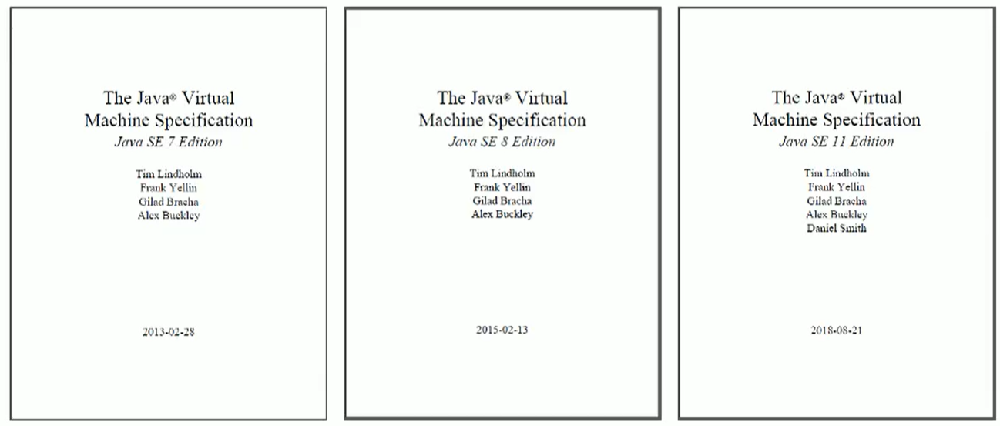

# 第一章 JVM和Java体系结构

## 1 前言

* **你是否也遇到过这些问题？**
  * 运行着的线上系统突然卡死，系统无法访问，甚至直接OOM！
  * 想解决线上JVM GC问题，却无从下手
  * 新项目上线，对各种JVM参数设置一脸茫然，直接默认吧，然后就JJ了
  * 每次面试之前都要重新背一遍JVM的一些原理概念性的东西，然而面试官却经常问你在实际项目中如何调优JVM参数，如何解决GC、OOM等问题，一脸懵逼。
* 大部分Java开发人员，除会在项目中使用到与Java平台相关的各种高精尖技术之外，对于Java技术的核心Java虚拟机了解甚少

* 开发人员如何看待上层框架？

  * 一些有一定工作经验的开发人员，打心眼儿里觉得SSM、微服务等上层技术才是重点，基础技术并不重要，这其实是一种本末倒置的“病态”。
  * 如果我们把核心类库的API比作数学公式的话，那么Java虚拟机的知识就好比公式的推导过程

* 计算机系统体系对我们来说越来越远，在不了解底层实现的前提下，通过高级语言很容易编写程序代码。但事实上计算机并不认识高级语言

  

* **架构师每天都在思考什么？**

  * 应该如何让我的系统更快？
  * 如何避免系统出现瓶颈？

* 知乎上有条帖子：应该如何看招聘信息，直通年薪50万+？

  * 参与现有系统的性能优化，重构，保证平台性能和稳定性
  * 根据业务场景和需求，决定技术方向，做技术选型
  * 能够独立架构和设计海量数据下的并发分布式解决方案，满足功能和非功能需求
  * 解决各类潜在的系统风险，核心功能的架构与代码编写
  * 分析系统瓶颈，解决各种疑难杂症，性能调优等

* 我们为什么要学习JVM？

  * 面试的需要（BATJ、TMD、PKQ面试都爱问）
  * 中高级程序员必备技能
    * 项目管理、调优的需要
  * 追求极客的精神
    * 比如：垃圾回收算法、JIT、底层原理

* Java  vs  C++

  

## 2 面向人群及参考书目

* 面向人群

  * 拥有一定开发经验的Java平台开发人员
  * 软件设计师、架构师
  * 系统调优人员
  * 有一定的Java编程基础并希望进一步了解Java的程序员
  * 虚拟机爱好者，JVM实践者

* 这个课怎么讲？

  * 理论时间 多于 代码时间
  * 通俗、易懂、讲人话
  * 图解

* 参考书目

  java8规范网址：https://docs.oracle.com/javase/specs/jls/se8/html/index.html

  

  

  

  

## 3 Java及JVM简介

## 4 Java发展的重大事件

## 5 虚拟机与Java虚拟机

## 6 JVM整体结构

## 7 Java代码执行流程

## 8 JVM的架构模型

## 9 JVM的生命周期

## 10 JVM的发展历程

