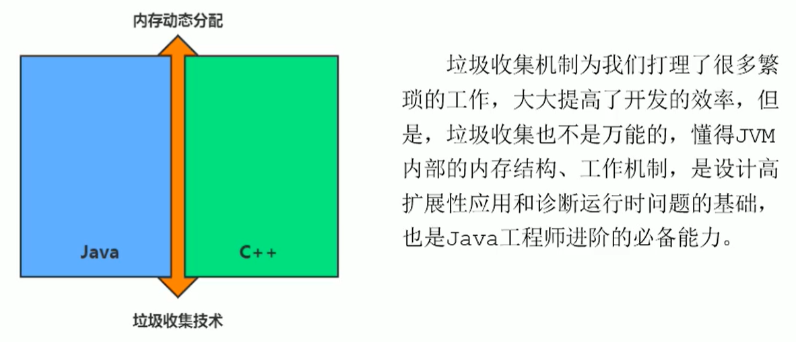
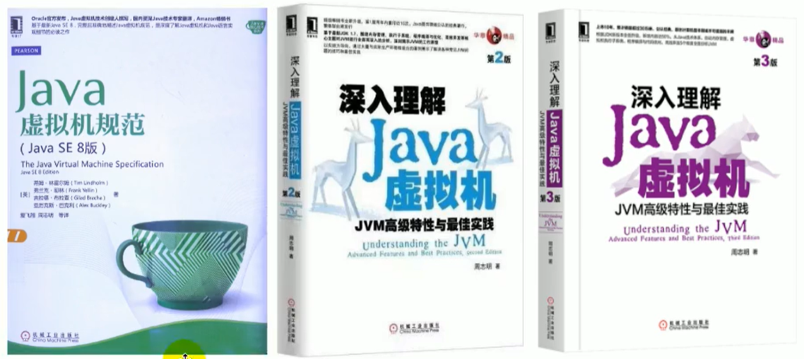
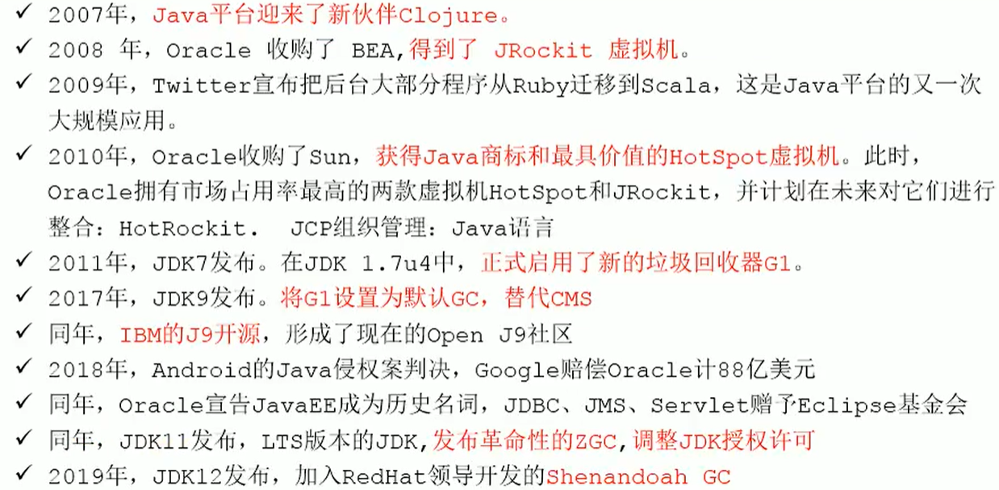
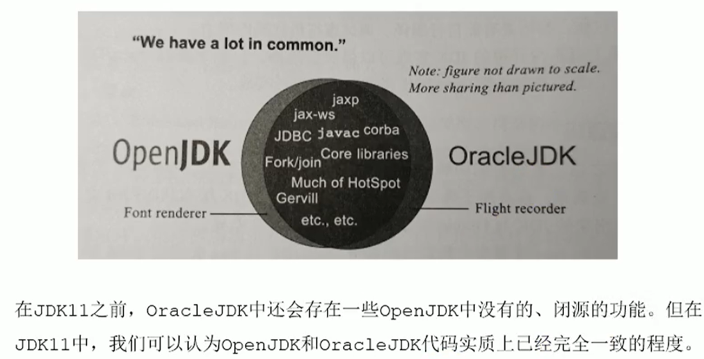

# 第一章 JVM和Java体系结构

## 1 前言

* **你是否也遇到过这些问题？**
  * 运行着的线上系统突然卡死，系统无法访问，甚至直接OOM！
  * 想解决线上JVM GC问题，却无从下手
  * 新项目上线，对各种JVM参数设置一脸茫然，直接默认吧，然后就JJ了
  * 每次面试之前都要重新背一遍JVM的一些原理概念性的东西，然而面试官却经常问你在实际项目中如何调优JVM参数，如何解决GC、OOM等问题，一脸懵逼。
* 大部分Java开发人员，除会在项目中使用到与Java平台相关的各种高精尖技术之外，对于Java技术的核心Java虚拟机了解甚少

* 开发人员如何看待上层框架？

  * 一些有一定工作经验的开发人员，打心眼儿里觉得SSM、微服务等上层技术才是重点，基础技术并不重要，这其实是一种本末倒置的“病态”。
  * 如果我们把核心类库的API比作数学公式的话，那么Java虚拟机的知识就好比公式的推导过程

* 计算机系统体系对我们来说越来越远，在不了解底层实现的前提下，通过高级语言很容易编写程序代码。但事实上计算机并不认识高级语言

  

* **架构师每天都在思考什么？**

  * 应该如何让我的系统更快？
  * 如何避免系统出现瓶颈？

* 知乎上有条帖子：应该如何看招聘信息，直通年薪50万+？

  * 参与现有系统的性能优化，重构，保证平台性能和稳定性
  * 根据业务场景和需求，决定技术方向，做技术选型
  * 能够独立架构和设计海量数据下的并发分布式解决方案，满足功能和非功能需求
  * 解决各类潜在的系统风险，核心功能的架构与代码编写
  * 分析系统瓶颈，解决各种疑难杂症，性能调优等

* 我们为什么要学习JVM？

  * 面试的需要（BATJ、TMD、PKQ面试都爱问）
  * 中高级程序员必备技能
    * 项目管理、调优的需要
  * 追求极客的精神
    * 比如：垃圾回收算法、JIT、底层原理

* Java  vs  C++

  

## 2 面向人群及参考书目

* 面向人群

  * 拥有一定开发经验的Java平台开发人员
  * 软件设计师、架构师
  * 系统调优人员
  * 有一定的Java编程基础并希望进一步了解Java的程序员
  * 虚拟机爱好者，JVM实践者

* 这个课怎么讲？

  * 理论时间 多于 代码时间
  * 通俗、易懂、讲人话
  * 图解

* 参考书目

  java8规范网址：https://docs.oracle.com/javase/specs/jls/se8/html/index.html

  

  

  

  

## 3 Java及JVM简介

* 语言热度排行榜：https://www.tiobe.com/tiobe-index/

* Java生态圈

  * **作为一个平台**：Java虚拟机扮演着举足轻重的作用。Groovy、Scala、JRuby、Kotlin等都是Java平台的一部分
  * **作为一种文化**：
    * 第三方开源软件和框架。如Tomcat、Struts、MyBatis、Spring等。
    * 就连JDK和JVM自身也有不少开源的实现，如OpenJDK、Harmony。
  * **作为一个社区**：Java拥有全世界最多的技术拥护者和开源社区支持，有数不清的论坛和资料。

* Java：跨平台的语言

  

* Java虚拟机规范

  

* JVM：跨语言的平台

  

  * 随着Java7的正式发布，Java虚拟机的设计者们通过JSR-292规范基本实现在**Java虚拟机平台运行非Java语言编写的程序**
  * Java虚拟机根本不关心运行在其内部的程序到底是使用何种语言编写的，**它值关心“字节码”文件**。

* **Java不是最强大的语言，但是JVM是最强大的虚拟机。**

* 我们平时说的java字节码，指的是用java语言编写成的字节码。准确的说任何能在jvm平台执行的字节码格式都是一样的。所以应该统称为：**jvm字节码**。

* 不同的编译器，可以编译出相同的字节码文件，字节码文件也可以在不同的JVM上运行。

* Java虚拟机与Java语言并没有必然的联系，它只与特定的二进制文件格式------Class文件格式所关联，Class文件包含了Java虚拟机指令集（或者称为字节码、Bytecodes）和符号表，还有一些其他辅助信息。

* 多语言混合编程

  * **Java平台上的多语言混合编程称为主流，通过特定的语言去解决特定领域的问题是当前软件开发应对日趋复杂的项目需求的一个方向**。
  * 试想一下，在一个项目之中，并行处理用Clojure语言编写，展示层使用JRuby/Rails，中间层使用Java，每个应用层都将使用不同的编程语言来完成，而且，接口对每一层的开发者都是透明的，**各种语言之间的交互不存在任何困难，就像使用自己语言的原生PAI一样方便，因为它们最终都运行在一个虚拟机上**。
  * 对这些运行在Java虚拟机上、Java之外的语言，来自系统的、底层的支持正在迅速增长，以JSR-292为核心的一系列项目和功能改进（如DaCinci Machine项目、Nashorn引擎、InvokeDynamic指令、java.lang.invoke包等），**推动Java虚拟机从“Java语言的虚拟机”向“多语言虚拟机”的方向发展**。

* 如何真正搞懂JVM？

  

## 4 Java发展的重大事件

## 5 虚拟机与Java虚拟机

* 虚拟机

  * 所谓虚拟机（Virtual Machine），就是一台虚拟的计算机。它是一款软件，用来执行一系列虚拟计算机指令。大体上，虚拟机可以分为**系统虚拟机**和**程序虚拟机**。
    * 大名鼎鼎的Vitural Box，VMware就属于系统虚拟机，他们**完全是对物理计算机的仿真**，提供了一个可运行完整操作系统的软件平台
    * 程序虚拟机的典型代表就是Java虚拟机，它**专门为执行单个计算机程序而设计**，在Java虚拟机中执行的命令我们称为Java字节码指令。
  * 无论是系统虚拟机还是程序虚拟机，在上面运行的软件都被限制于虚拟机提供的资源中

* Java虚拟机

  * Java虚拟机是一台执行Java字节码的虚拟计算机，它拥有独立的运行机制，其运行的Java字节码也未必是由Java语言编写而成的。
  * JVM平台的各种语言可以共享Java虚拟机的跨平台、优秀的垃圾回收器，以及可靠的及时编译器。
  * **Java技术的核心就是Java虚拟机**（JVM，Java Virtual Machine），因为所有的Java程序都运行在Java虚拟机内部
  * 作用：**Java虚拟机就是二进制字节码的运行环境**，负责装在字节码到其内部，解释/编译为对应平台的机器指令执行。每一条Java命令，Java虚拟机规范都有详细定义，如怎么去操作数，处理结果放在哪里。
  * 特点
    * 一次编译，导出运行
    * 自动内存管理
    * 自动垃圾回收功能

* JVM的位置

  

  

* Google的Android系统结构

  

  Dalvik Virtal Machine解释执行.dex文件

## 6 JVM整体结构

## 7 Java代码执行流程

## 8 JVM的架构模型

## 9 JVM的生命周期

## 10 JVM的发展历程

