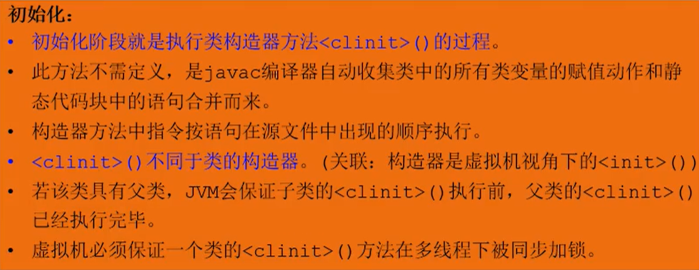

# 第二章 类加载子系统

## 1 内存结构概述

* 简图


* 详细图（英文版）


* 详细图（中文版）


* 类加载器子系统


* 运行时数据区


* 执行引擎等


* 如果自己手写一个Java虚拟机的话，主要考虑哪些结构呢？
  * 类加载器和执行引擎

## 2 类加载器与类的加载过程

* 类加载器子系统作用

  * 类加载器子系统作用负责从文件系统或者网络中加载Class文件，class文件在文件开头会有特定的文件标识。
  * ClassLoader只负责class文件的加载，只与它是否可以运行，则由Execution Engine决定。
  * 加载的类信息存放在一块称为<font color=red>**方法区**</font>的内存空间。除了类的信息外，方法区中还会存放运行时常量池信息，可能还包括字符串字面量和数字常量（这部分常量信息时Class文件中常量池部分的内存映射）

* 类加载器ClassLoader的角色

  

* 类的加载过程

  

  ```java
  public class HelloLoader {
      public static void main(String[] args) {
          System.out.println("谢谢ClassLoader加载我....");
          System.out.println("你的大恩大德，我下辈子再报！");
      }
  }
  ```

  

  * 加载：

    1. 通过一个类的全限名获取定义此类的二进制字节流

    2. 将这个字节流所代表的静态存储结构转化为方法区的运行时数据结构
    3. <font color=red>**在内存中生成一个代表这个类的java.lang.Class对象**</font>，作为方法区这个类的各种数据的访问入口

    * 补充：加载.class文件放入方式
      * 从本地系统中直接加载
      * 通过网络获取，典型场景：Web Applet
      * 从zip压缩包中读取，成为日后jar、war格式的基础
      * 运行时计算生成，使用最多的是：动态代理技术
      * 由其他文件生成，典型场景：JSP应用
      * 从专有数据库中提取.class文件，比较少见
      * 从加密文件中获取，典型的防Class文件被反编译的保护措施

  * 链接

    

  * 初始化

    

    ---

    ```java
    public class ClassInitTest {
       private static int num = 1;
    
       static{
           num = 2;
           number = 20;
           System.out.println(num);
           //System.out.println(number);//报错：非法的前向引用。
       }
    
       private static int number = 10;  // linking之prepare: number = 0 --> initial: 20 --> 10
    
        public static void main(String[] args) {
            System.out.println(ClassInitTest.num);  // 2
            System.out.println(ClassInitTest.number);  // 10
        }
    }
    ```

    **结果：**

    ​			2

    ​			10

    通过jclasslib可以查看其内部执行过程

    

    ---
    
JVM会保证父类的\<clinit>()首先执行
    
    ```java
    public class ClinitTest1 {
        static class Father{
            public static int A = 1;
            static{ A = 2; }
        }
    
        static class Son extends Father{
            public static int B = A;
        }
    
        public static void main(String[] args) {
            //加载Father类，其次加载Son类。
            System.out.println(Son.B);//2
        }
    }
```
    
    ---
    
    虚拟机必须保证一个类的\<clinit>()方法在多线程下被同步加锁，并且只会被加载一次
    
    ```java
    public class DeadThreadTest {
        public static void main(String[] args) {
            Runnable r = () -> {
                System.out.println(Thread.currentThread().getName() + "开始");
                DeadThread dead = new DeadThread();
                System.out.println(Thread.currentThread().getName() + "结束");
            };
    
            Thread t1 = new Thread(r,"线程1");
            Thread t2 = new Thread(r,"线程2");
    
            t1.start();
            t2.start();
        }
    }
    
    class DeadThread{
        static{
            if(true){
                System.out.println(Thread.currentThread().getName() + "初始化当前类");
                try {
                    Thread.sleep(1000);
                } catch (InterruptedException e) {
                    e.printStackTrace();
                }
            }
        }
    }
    ```
    
    **结果：**
    
    ​			线程1开始
    
    ​			线程2开始
    
    ​			线程1初始化当前类
    
    ​			线程2结束
    
    ​			线程1结束

## 3 类加载器分类

* JVM支持两种类型的类加载器，分别是<font color=red>**引导类加载器（Bootstrap ClassLoader）**</font>和<font color=red>**自定义类加载器（User-Defined ClassLoader）**</font>

* 从概念上讲，自定义类加载器是指程序中由开发人员自定义的一类加载器，然而Java虚拟机规范却并没有这么定义，而是<font color=red>**将所有派生与抽象类ClassLoader的类加载器都划分为自定义类加载器**</font>。

* 无论类加载器的类型如何划分，在程序中我们最常见的类加载器始终只有三个，如下图：

  

  Bootstrap ClassLoader是由C++语言实现的，其余的是由Java语言实现的

  

  ---

  ```java
  public class ClassLoaderTest {
      public static void main(String[] args) {
  
          //获取系统类加载器
          ClassLoader systemClassLoader = ClassLoader.getSystemClassLoader();
          System.out.println(systemClassLoader);//sun.misc.Launcher$AppClassLoader@18b4aac2
  
          //获取其上层：扩展类加载器
          ClassLoader extClassLoader = systemClassLoader.getParent();
          System.out.println(extClassLoader);//sun.misc.Launcher$ExtClassLoader@1540e19d
  
          //获取其上层：获取不到引导类加载器
          ClassLoader bootstrapClassLoader = extClassLoader.getParent();
          System.out.println(bootstrapClassLoader);//null
  
          //对于用户自定义类来说：默认使用系统类加载器进行加载
          ClassLoader classLoader = ClassLoaderTest.class.getClassLoader();
          System.out.println(classLoader);//sun.misc.Launcher$AppClassLoader@18b4aac2
  
          //String类使用引导类加载器进行加载的。---> Java的核心类库都是使用引导类加载器进行加载的。
          ClassLoader classLoader1 = String.class.getClassLoader();
          System.out.println(classLoader1);//null
      }
  }
  ```

  

## 4 ClassLoader的使用说明


## 5 双亲委派机制


## 6 其他