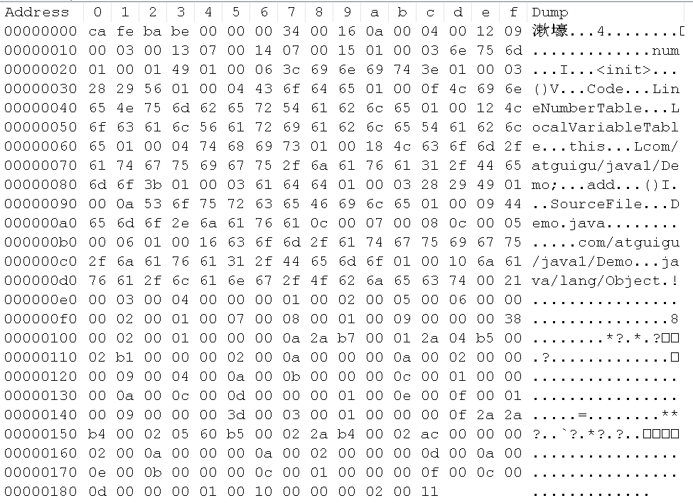
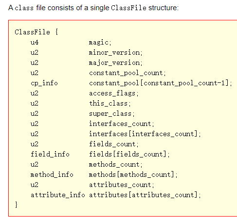
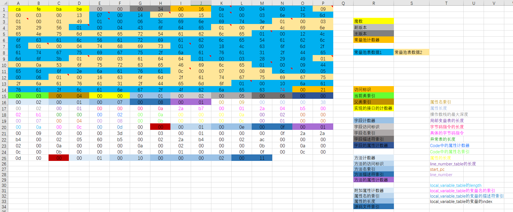
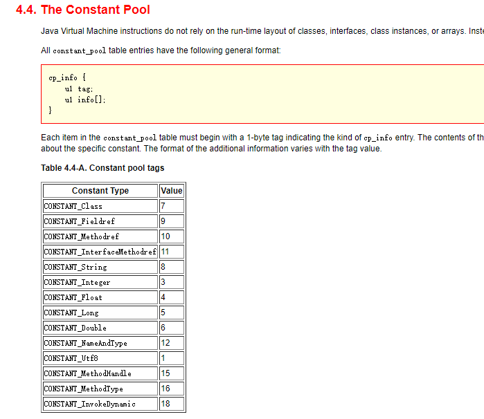
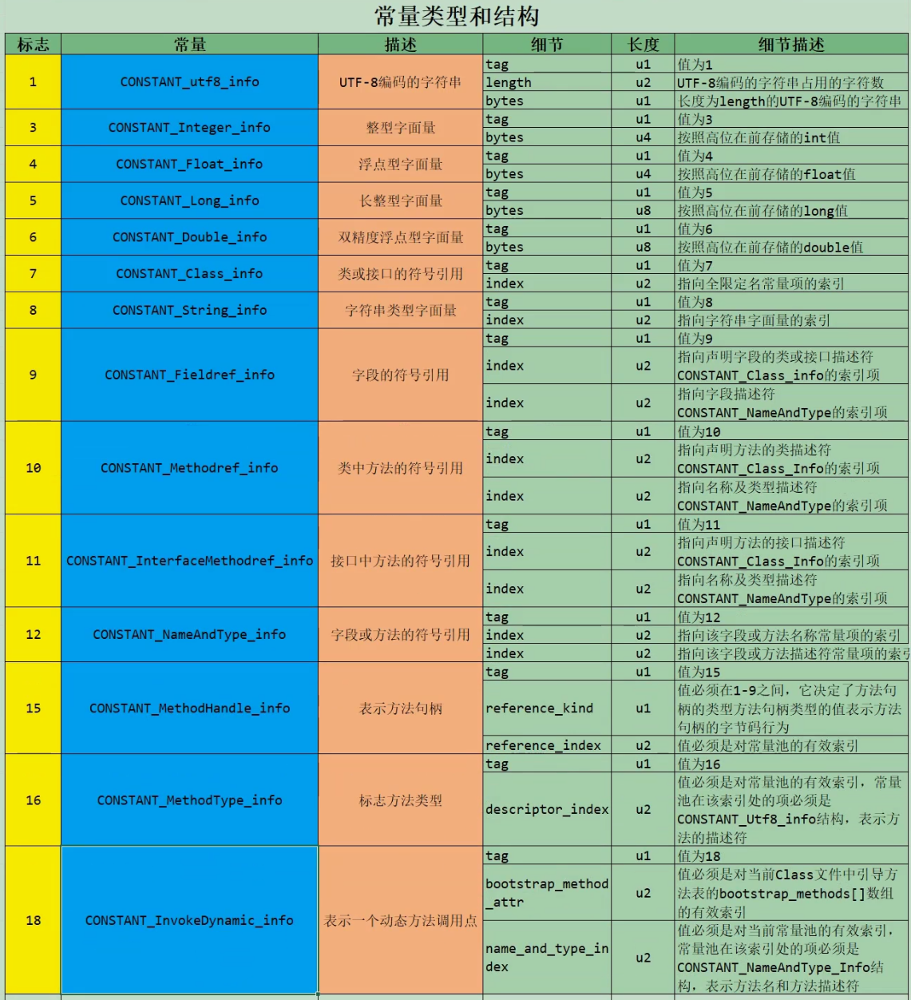
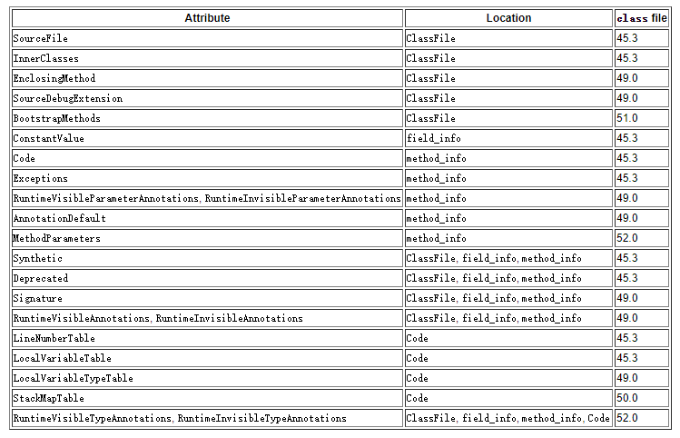
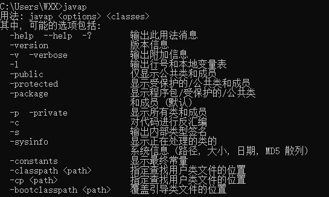

# 第18章 Class文件结构

## 1 概述

* 作为Java程序员，为什么我们需要接触字节码文件？

  * 字节码文件的跨平台性

  1. <font color=red>**Java语言：跨平台的语言（write once, run anywhere）**</font>
     * 当Java源代码成功编译成字节码后，如果想在不同平台运行，则无需再次编译
     * 这个优势不再那么吸引人了。Python、PHP、Perl、Ruby、Lisp等有强大的编译器
     * 跨平台似乎已经快成为一门语言必选的特性了
  2. <font color=red>**Java虚拟机：跨语言的平台**</font>
     * <font color=red>**Java虚拟机不和包括Java在内的任何语言绑定，它只与“Class文件”这种特定的二进制文件格式所关联。**</font>无论使用何种语言进行软件开发，只要能将源文件编译为正确的Class文件，那么这种预压就可以在Java虚拟机上执行。可以说，统一而强大的Class文件结构，就是Java虚拟机的基石、桥梁。

  

  https://docs.oracle.com/javase/specs/index.html

  所有的JVM都遵循Java虚拟机规范，也就是说所有的JVM环境都是一样的，这样一来字节码文件可以在各种JVM上运行。

  3. **想要让一个Java程序正确地运行在JVM中，Java源码就就必须要被编译为符合JVM规范的字节码。**

     * <font color=red>**前端编译器的主要任务**</font>就是负责将符合Java语法规范的Java代码转换为符合JVM规范的字节码文件。
     * javac是一种能够将Java源码编译为字节码的前端编译器。
     * javac编译器在将Java源码编译为一个有效的字节码文件过程中经历了4个步骤，分别是<font color=red>**词法解析、语法解析、语义解析以及生成字节码**</font>。

     

     Oracle的JDK软件包括两部分内容：

     * 一部分是将Java源代码编译成Java虚拟机的指令集的编译器
     * 另一部分是用于实现Java虚拟爱的运行时环境

  * 可以通过字节码指令看代码细节

  1. **BAT面试题**

     ①  类文件结构有几个部分？

     ②  知道字节码吗？字节码指令都有哪些？Integer x = 5; int y = 5;比较x == y 都经过哪些步骤？

  2. **代码举例**

     * 例1

     ```java
     public class IntegerTest {
         public static void main(String[] args) {
             Integer x = 5;
             int y = 5;
             System.out.println(x == y); // true
     
             Integer i1 = 10;
             Integer i2 = 10;
             System.out.println(i1 == i2);  // true
     
             Integer i3 = 128;
             Integer i4 = 128;
             System.out.println(i3 == i4);  // false
         }
     }
     ```

     * 例2

     ```java
     public class StringTest {
         public static void main(String[] args) {
             String str = new String("hello") + new String("world");
             String str1 = "helloworld";
             System.out.println(str == str1);  // false
             String str2 = new String("helloworld");
             System.out.println(str == str2);  // false
         }
     }
     ```

     

     * 例3

     ```java
     /*
     成员变量（非静态的）的赋值过程： ① 默认初始化 - ② 显式初始化 /代码块中初始化 - ③ 构造器中初始化 - ④ 有了对象之后，可以“对象.属性”或"对象.方法"
      的方式对成员变量进行赋值。
      */
     class Father {
         int x = 10;  // ② 显示初始化
         int y;  // ① 默认初始化为0
         public Father() {
             this.print();
             x = 20;  // ③ 构造器中初始化
         }
         public void print() {
             System.out.println("Father.x = " + x);
         }
     }
     
     class Son extends Father {
         int x = 30;
         public Son() {
             this.print();
             x = 40;
         }
         public void print() {
             System.out.println("Son.x = " + x);
         }
     }
     
     public class SonTest {
         public static void main(String[] args) {
             Father f = new Son();
             System.out.println(f.x);
         }
     }
     ```

     **结果：**

     ​			Son.x = 0
     ​			Son.x = 30
     ​			20

     

     main中的代码执行：首先会调用Father的构造器方法，然后调用到Father()中的this.print()方法，因为子类重写了该方法，所以会调用子类的方法，此时输出子类的x，为0；然后Son中的 x 进行显式初始化，赋值为30，调用Son中的this.print()后输出30；之后 x 被赋值为 40，因为 f 类型是 Father，属性不存在多态性，所以最后输出20

* Java的 前端编译器 vs. 后端编译器

  

  * Java源代码的编译结果是字节码，那么肯定需要一种编译器能够将Java源码编译为字节码，承担这个重要责任的就是配置在path环境变量中的<font color=red>**javac编译器**</font>。javac是一种能够将Java源码编译为字节码的<font color=red>**前端编译器**</font>。
  * HotSpot VM并没有强制要求前端编译器只能使用javac来编译字节码，其实只要编译结果符合JVM规范都可以被JVM所识别即可。在Java的前端编译器领域，除了javac之外，还有一种被大家经常使用到的前端编译器，那就是内置在Eclipse中的<font color=red>**ECJ（Eclipse Compiler for Java）编译器**</font>。和javac的全量式编译不同，ECJ是一种增量式编译器。
    * 在Eclipse中，当开发人员编写完代码后，使用“Ctrl+S”快捷键时，ECJ编译器采取的<font color=red>**编译方案**</font>是把未编译部分的源码逐行进行编译，而非每次都全量编译。因此ECJ的编译效率会比javac更加迅速和高效，当然编译质量和javac相比大致还是一样的。
    * ECJ不仅是Eclipse的默认内置前端编译器，在Tomcat中同样也是使用ECJ编译器来编译jsp文件。由于ECJ编译器是采用GPLv2的开源协议进行源代码公开，所以大家可以登录Eclipse官网下载ECJ编译器的源码进行二次开发。
    * 默认情况下，IntelliJ IDEA使用javac编译器（还可以自己设置AspectJ编译器ajc）
  * 前端编译器并不会直接涉及编译优化等方面的技术，而是将这些具体优化细节移交给HotSpot的JIT编译器负责。
  * 复习：AOT（静态提前编译器，Ahead Of Time Compiler）


## 2 虚拟机的基石：Class文件

* 字节码文件是什么？

  * 源代码经过编译器编译之后便会生成一个字节码文件，字节码文件是一种二进制的类文件，它的内容是JVM的指令，而不像C、C++经由编译器直接生成机器码。

* 什么是字节码指令（byte code）？

  * Java虚拟机的指令由一个字节长度的、代表着某种特定操作含义的<font color=red>**操作码**</font>（opcode）以及跟随其后的零至多个代表次操作所需参数的<font color=red>**操作数**</font>（operand）所构成。虚拟机中许多指令并不包含操作数，只有一个操作码。

  

* 如何解读供虚拟机解释执行的二进制字节码？

  * 方式一：一个一个二进制的看，这里用到的是Notepad++，需要安装一个HEX-Editor插件，或者使用Binary Viewer
  * 方式二：使用javap指令：jdk自带的反解析工具
  * 方式三：使用IDEA插件：jclasslib或jclasslib bytecode viewer客户端工具。（可视化更好）

## 3 Class文件结构

* 官方文档位置：https://docs.oracle.com/javase/specs/jvms/se8/html/jvms-4.html

* Class类的本质

  * 任何一个Class文件都对应着唯一一个类或接口的定义信息，但反过来说，Class文件实际上它并不一定以磁盘文件的形式存在。Class文件是一组以8位字节为基础的<font color=red>**二进制流**</font>。

* Class文件格式

  * Class的结构不像XML等描述语言，由于它没有任何分割符号。所以在其中的数据项，无论是字节顺序还是数量，都是被严格限定的，哪个字节代表什么含义，长度时多少，先后顺序如何，都不允许改变。

  * Class文件格式采用一种类似于C语言结构体的方式进行数据存储，这种数据结构只有两种数据类型：<font color=red>**无符号数**</font>和<font color=red>**表**</font>。

    * 无符号数属于基本数据类型，以 u1、u2、u4、u8 来分别代表 1 个字节、2个字节、4个字节和 8 个字节的无符号数，无符号数可以用来描述数字、索引引用、数量值或者按照 UTF-8 编码构成的字符串值。
    * 表是由多个无符号数或者其他表作为数据项构成的符合数据类型，所有表都习惯性地以"_info"结尾。表用于描述有层次关系的符合结构的数据，整个Class文件本质上就是一张表。由于表没有固定长度，所以通常会在其前面加上个数说明。

  * 代码举例

    ```java
    package com.atguigu.java1;
    
    /**
     * @author shkstart
     * @create 2020-08-31 8:52
     * 全类名：com.atguigu.java1.Demo
     * 全限定名：com/atguigu/java1/Demo
     */
    public class Demo {
        private int num = 1;
    
        public int add(){
            num = num + 2;
            return num;
        }
    }
    ```

    生成的Demo.class里面的内容如下：

    

---

* Class文件结构概述

  Class文件的结构并不是一成不变的，随着Java虚拟机的不断发展，总是不可避免的对Class文件结构做出一些调整，但是其基本结构和框架是非常稳定的。

  * Class文件的总体结构如下：
    * 魔数
    * Class文件版本
    * 常量池
    * 访问标志
    * 类索引，父类索引，接口索引集合
    * 字段表集合
    * 方法表集合
    * 属性表集合

  

  | 类型           | 名称                | 说明                    | 长度    | 数量                  |
  | -------------- | ------------------- | ----------------------- | ------- | --------------------- |
  | u4             | magic               | 魔数，识别Class文件格式 | 4个字节 | 1                     |
  | u2             | minor_version       | 副版本号（小版本）      | 2个字节 | 1                     |
  | u2             | major_version       | 主版本号（大版本）      | 2个字节 | 1                     |
  | u2             | constant_pool_count | 常量池计数器            | 2个字节 | 1                     |
  | cp_info        | constant_pool       | 常量池表                | n个字节 | constant_pool_count-1 |
  | u2             | access_flags        | 访问标识                | 2个字节 | 1                     |
  | u2             | this_class          | 类索引                  | 2个字节 | 1                     |
  | u2             | super_class         | 父类索引                | 2个字节 | 1                     |
  | u2             | interfaces_count    | 接口计数器              | 2个字节 | 1                     |
  | u2             | interfaces          | 接口索引集合            | 2个字节 | interfaces_count      |
  | u2             | fields_count        | 字段计数器              | 2个字节 | 1                     |
  | field_info     | fields              | 字段表                  | n个字节 | fields_count          |
  | u2             | methods_count       | 方法计数器              | 2个字节 | 1                     |
  | method_info    | methods             | 方法表                  | n个字节 | methods_count         |
  | u2             | attributes_count    | 属性计数器              | 2个字节 | 1                     |
  | attribute_info | attributes          | 属性表                  | n个字节 | attributes_count      |

  

---



---

* <font color=red>**Magic Number（魔数）**</font>

  * 每个Class文件开头的4个字节的无符号整数称为魔数（Magic Number）

  * 它的唯一作用是确定这个文件是否为一个能被虚拟机接收的有效合法的Class文件。即：魔数是Class文件的标识符。

  * 魔数值固定为 0xcafebabe。不会改变。

  * 如果一个Class文件不是以 0xcafebabe 开头，虚拟机在进行文件校验的时候的时候就会抛出以下错误：

    

  * 使用魔数而不是扩展名来进行识别主要是基于安全方面的考虑，因为文件扩展名可以随意改动。

---

* <font color=red>**Class文件版本号**</font>

  * 紧接着魔数的 4 个字节存储的是Class文件的版本号。同样也是 4 个字节。第 5 个和第 6 个字节代表的含义就是编译的副版本号minor_version，而第 7 个和第 8 个字节就是编译的主版本号major_version。

  * 他们共同构成了class文件的格式版本号。譬如某个Clacc文件的主版本号为M，副版本号为m，那么这个Class文件的格式版本号就确定为 M.m。

  * 版本号和Java编译器的对应关系如下表：

    | 主版本（十进制） | 副版本（十进制） | 编译器版本 |
    | ---------------- | ---------------- | ---------- |
    | 45               | 3                | 1.1        |
    | 46               | 0                | 1.2        |
    | 47               | 0                | 1.3        |
    | 48               | 0                | 1.4        |
    | 49               | 0                | 1.5        |
    | 50               | 0                | 1.6        |
    | 51               | 0                | 1.7        |
    | 52               | 0                | 1.8        |
    | 53               | 0                | 1.9        |
    | 54               | 0                | 1.10       |
    | 55               | 0                | 1.11       |

  * Java的版本号是从 45 开始的，JDK1.1之后的每个JDK大版本发布主版本号加1。

  * <font color=red>**不同版本的Java编译器编译的Class文件对应的版本是不一样的。目前，高版本的Java虚拟机可以执行低版本编译器生成的Class文件，但是低版本的Java虚拟机不能执行由高版本编译器生成的Class文件。否则JVM会抛出java.lang.UnsupportedClassVersionError异常**</font>。

    * 演示在 JDK1.8 编译出的class文件在 1.6的环境下运行

      

      

      

  * 在实际应用中，由于开发环境和生产环境的不同。可能会导致上述问题的发生。因此，需要我们在开发时，特别注意开发编译的JDK版本和实际生产环境中的JDK版本是否一致。

    * 虚拟机JDK版本为 1.k（k >= 2）时，对应的class文件版本号范围为45.0 - 44+k.0（含两端）。

---

* <font color=red>**常量池：存放所有常量**</font>

  * 常量池是Class文件中内容最为丰富的区域之一。常量池对于Class文件中的字段和方法解析也有着至关重要的作用。
  * 随着Java虚拟机的不断发展，常量池的内容也日渐丰富。可以说，常量池是整个Class文件的基石。

  

  * 在版本号之后，紧跟着的是常量池中常量的数量，以及若干个常量池表项。
  * 常量池中常量的数量不是固定的，所以在常量池的入口需要放置一项 u2 类型的无符号数，代表常量池容量计数值（constant_pool_count）。与Java中语言习惯不一样的是，这个容量计数器是从1而不是从0开始的。

  | 类型           | 名称                | 数量                  |
  | -------------- | ------------------- | --------------------- |
  | u2（无符号数） | constant_pool_count | 1                     |
  | cp_info（表）  | constant_pool       | constant_pool_count-1 |

  由上表可见，Class文件使用了一个前置的容量计数器（constant_pool_count）加上若干个连续的数据项（constant_pool）的形式来描述常量池内容。我们把这一系列连续常量池数据成为常量池集合。

  * <font color=red>**常量池表项**</font>中，用于存放编译时期生成的各种<font color=blue>**字面量**</font>和<font color=blue>**符号引用**</font>，这部分内容将在类加载（具体是指：加载、链接（验证、初始化、解析）、初始化中的链接阶段中的解析阶段）后进入方法区的<font color=red>**运行时常量池**</font>中存放。

  

  

  * **常量池计数器（constant_pool_count）**

    * 由于常量池的数量不固定，时长时短，所以需要放置两个字节来表示常量池容量计数值。
    * 常量池容量计数器（u2类型）：**从 1 开始**，表示常量池中有多少项常量。即 constant_pool_count=1 表示常量池中有0个常量项。
    * Demo的值为：

    

    其值为0x0016，转换为十进制是22。需要注意的是，这实际上只有21项常量。索引范围是1-21.为什么呢？

    * 通常我们写代码时都是从0开始的，但是这里的常量池却是从1开始，因为它把第0项常量空出来了。这是为了满足后面某些指向常量池的索引值的数据在特定情况下需要表达“不引用任何一个常量池项目”的含义，这种情况可以用索引0来表示。

  

  

  * **常量池表（constant_pool []）**

    * constant_pool 是一种表结构，以 1 ~ constant_pool _count - 1为索引。表明后面有多少常量项。
    * 常量池主要存放两大类常量：<font color=red>**字面量（Literal）**</font>和<font color=red>**符号引用（Symbolic References）**</font>。
    * 它包含了class文件结构及其子结构中引用的所有字符串常量、类或接口名和其他常量。常量池中的每一项都具备相同的特征。第一个字节作为标记类型，用于确定该项的格式，这个字节称为**tag type**（标记字节、标签字节）：一共14个

    | 类型                             | 标志（标识） | 描述                   |
    | -------------------------------- | ------------ | ---------------------- |
    | CONSTANT_utf8_info               | 1            | UTF-8编码的字符串      |
    | CONSTANT_Integer_info            | 3            | 整形字面量             |
    | CONSTANT_Float_info              | 4            | 浮点型字面量           |
    | CONSTANT_Long_info               | 5            | 长整型字面量           |
    | CONSTANT_Double_info             | 6            | 双精度浮点型字面量     |
    | CONSTANT_Class_info              | 7            | 类或接口的符号引用     |
    | CONSTANT_String_info             | 8            | 字符串类型字面量       |
    | CONSTANT_Fieldref_info           | 9            | 字段的符号引用         |
    | CONSTANT_Methodref_info          | 10           | 类中方法的符号引用     |
    | CONSTANT_InterfaceMethodref_info | 11           | 接口中方法的符号引用   |
    | CONSTANT_NameAndType_info        | 12           | 字段或方法的的符号引用 |
    | CONSTANT_MethodHandle_info       | 15           | 表示方法句柄           |
    | CONSTANT_MethodType_info         | 16           | 标志方法类型           |
    | CONSTANT_InvokeDynamic_info      | 18           | 表示一个动态方法调用点 |

    * 字面量和符号引用

      在对这些常量解读之前，我们需要搞清楚几个概念。

      常量池主要存放两大类常量：字面量（Literal）和符号引用（Symbolic Reference）。如下表：

      |   常量   |     具体的常量      |
      | :------: | :-----------------: |
      |  字面量  |     文本字符串      |
      |          | 声明为final的常量值 |
      | 符号引用 | 类和接口的全限定名  |
      |          | 字段的名称和描述符  |
      |          | 方法的名称和描述符  |

      * 全限定名

      com/atguigu/test/Demo这个就是类的全限定名，仅仅是把包名的 “.” 替换成 “/” ，为了使连续的多个全限定名不产生混淆，在使用时最后一版会加入一个 “;” 表示全限定名结束。

      * 简单名称

      简单名称是指没有类型和参数修饰的方法或者字段名称，上面例子中的类的add()方法和num字段的简单名称分别是add 和 num。

      * 描述符

      <font color=red>**描述符的作用是用来描述字段的数据类型、方法的参数列表（包括数量、类型以及顺序）和返回值。**</font>根据描述符规则，基本数据类型（byte、char、short、boolean、int、long、float、double）以及代表无返回值的void类型都应一个大写字母来表示，而对象类型则用字符 **L** 加对象的全限定名表示，详见下表：

      | 标识符 | 含义                                                         |
      | ------ | ------------------------------------------------------------ |
      | B      | 基本数据类型byte                                             |
      | C      | 基本数据类型char                                             |
      | S      | 基本数据类型short                                            |
      | Z      | 基本数据类型boolean                                          |
      | I      | 基本数据类型int                                              |
      | J      | 基本数据类型long                                             |
      | F      | 基本数据类型float                                            |
      | D      | 基本数据类型double                                           |
      | V      | 代表void类型                                                 |
      | L      | 对象类型，比如：Ljava/lang/Object;                           |
      | [      | 数组类型，代表一维数组。比如：double[][][][][][\][\] is [[[D |

      例子：

      ```java
      public class ArrayTest {
          public static void main(String[] args) {
              Object[] arr = new Object[10];
              System.out.println(arr);  // [Ljava.lang.Object;@1540e19d
      
              String[] arr1 = new String[10];
              System.out.println(arr1);  // [Ljava.lang.String;@677327b6
      
              long[][] arr2 = new long[10][];
              System.out.println(arr2);  // [[J@14ae5a5
          }
      }
      ```

      * 补充说明：虚拟机在加载Class文件时才会进行动态链接，也就是说，Class文件不会保存各个字段和方法的最终内存布局信息，因此，这些字段和方法的符号引用不经过转换是无法直接被虚拟机使用的。<font color=red>**当虚拟机运行时，需要从常量池中获得对应的符号引用，再在类加载过程中的解析阶段将其替换为直接引用，并翻译到具体的内存地址中。**</font>这里说明下符号引用和直接引用的区别和关联：
        * 符号引用：符号引用以<font color=red>**一组符号**</font>来描述所引用的目标，符号可以是任何形式的字面量，只要使用时能无歧义地定位到目标即可。<font color=red>**符号引用与虚拟机实现的内存布局无关**</font>，引用的目标并不一定已经加载到了内存中。
        * 直接引用：直接引用可以是直接<font color=red>**指向目标的指针、相对偏移量或是一个能间接定位到目标的句柄**</font>。<font color=red>**直接引用是与虚拟机实现的内存布局相关的**</font>，同一个符号引用在不同虚拟机实例上翻译出来的直接引用一般不会相同。如果有了直接引用，那说明引用的目标必然已经存在于内存之中了。（虚拟机栈中的动态链接指向的内容：即方法区中的运行时常量池）

      

  * 常量池表小结：

    * CONSTANT_Integer_info出现在常量池表中的前提是要声明一个 final int 的常量

    * 标记为15、16、18的常量项类型是用来支持动态语言调用的（jdk1.7时才加入）。

    * 细节说明：

      * CONSTANT_Class_info 结构用于表明类或接口
      * CONSTANT_Fieldref_info、CONSTANT_Methodref_info、CONSTANT_InterfaceMethodref_info 结构表示字段、方法和接口方法
      * CONSTANT_String_info 结构用于表示 String 类型的常量对象
      * CONSTANT_Integer_info和CONSTANT_Float_info 表示 4 个字节（int 和 float）的数值常量
      * CONSTANT_Long_info 和 CONSTANT_Double_info 结构表示 8 字节（long 和 double）的数值常量
        * 在class文件的常量池表中，所有的 8 字节常量均占两个表成员（项）的空间。如果一个CONSTANT_Long_info 或 CONSTANT_Double_info 结构的项在常量池中的索引位置为n，则常量池表中的下一个可用项的索引位置为n+2，此时常量池表中索引位n+1的项仍然有效但必须视为不可用的。
      * CONSTANT_NameAndType_info 结构用于表示字段或方法，但是和之前的三个结构不同。CONSTANT_NameAndType_info结构没有指明该字段或方法所属的类或接口。
      * CONSTANT_utf8_info 用于表示字符串常量的值
      * CONSTANT_MethodHandle_info 结构用于表示方法句柄
      * CONSTANT_MethodType_info 结构用于表示方法类型
      * CONSTANT_InvokeDynamic_info 结构用于表示 invokedynamic指令所用到的引导方法（bootstrap method）、引导方法所用到的动态调用名称（dynamic invocation name）、参数和返回类型。并可以给引导方法传入一系列称为静态参数（static argument）的常量。

    * 解析方式：一个字节一个字节的解析

      

    * 总结1：

      * 这14种表（或者常量项结构）的共同点是：表开始的第一位是一个u1类型的标志位（tag），代表当前这个常量项使用的是哪种表结构，即哪种常量类型。
      * 在常量池列表中，CONSTANT_String_info 常量项是一种使用改进过得UTF-8编码格式来存储的如文字字符串、类或者接口的全限定名、字段或者方法的简单名称以及描述符等常量字符串信息。
      * 这14中常量项结构还有一个特点是，其中13项占用的字节数固定，只有CONSTANT_utf8_info 占用字节数不固定，其大小由length决定。为什么呢？<font color=red>**因为从常量池存放的内容可知，其存放的是字面量和符号引用，最终这些内容都会是一个字符串，这些字符串的大小是在编写程序时才确定**</font>，比如你定义一个类，类名可以取长取短，所以在没编译前，大小不固定，编译后，通过utf-8编码，就可以知道其长度。

    * 总结2：

      * 常量池：可以理解为Class文件之中的资源仓库，它是Class文件结构中与其他项目关联最多的数据类型（后面的很多数据类型都会指向此处），也是占用Class文件空间最大的数据项目之一。
      * **常量池中为什么要包含这些内容？**
        * Java代码在进行javac编译的时候，并不像C和C++那样有“链接”这一步骤，而是在虚拟机加载Class文件的时候才进行动态链接。也就是说，<font color=red>**在Class文件中不会保存各个方法、字段的最终内存布局信息，因此这些字段、方法的符号引用不经过运行期转换的话无法得到真正的内存入口地址，也就无法直接被虚拟机使用。**</font>当虚拟机运行时，需要从常量池获得对应的符号引用，再在类创建或运行时解析、翻译到具体的内存地址之中。关于类的创建和动态链接的内容，在虚拟机类加载过程时再进行详细讲解。

---

* <font color=red>**访问标识（access_flag、访问标志、访问标记）**</font>

  * 在常量池后，紧跟着访问标记。该标记使用两个字节标识，用于识别一些类或者接口层次的访问信息，包括：这个Class是类还是接口；是否定义为 public 类型；是否定义为 abstract 类型；如果是类的话，是否被声明为 final 等。各种访问标记如下所示：

  | 标志名称       | 标志值 | 含义                                                         |
  | -------------- | ------ | ------------------------------------------------------------ |
  | ACC_PUBLIC     | 0x0001 | 标志位public类型                                             |
  | ACC_FINAL      | 0x0010 | 标志被声明为final，只有类可以设置                            |
  | ACC_SUPER      | 0x0020 | 标志允许使用invokespecial字节码指令的新语义，JDK1.0.2之后编译出来的类这个标志默认为真。（使用增强的方法调用父类方法） |
  | ACC_INTERFACE  | 0x0200 | 标志这是一个接口                                             |
  | ACC_ABSTRACT   | 0x0400 | 是否为abstract类型，对于接口或者抽象类来说，此标志值为真，其他类型为假 |
  | ACC_SYNTHETIC  | 0x1000 | 标志此类并非由用户产生（即：由编译器产生的类，没有源码对应） |
  | ACC_ANNOTATION | 0x2000 | 标志这是一个注解                                             |
  | ACC_ENUM       | 0x4000 | 标志这是一个枚举                                             |

  * 类的访问权限通常为 ACC_ 开头的常量
  * 每一种类型的表示都是通过设置访问标识的32位中的特定位来实现的。比如，若是 public final 的类，则该标记为 ACC_PUBLIC | ACC_FINAL。
  * 使用 ACC_SUPER 可以让类更准确地定位到父类的方法 super.method()，现代编译器都会设置并且使用这个标记。
  * 补充说明：
    * 带有 ACC_INTERFACE 标志的 class 文件表示的是接口而不是类，反之则表示是类而不是接口。
      * 如果一个 class 文件被设置了 ACC_INTERFACE 标志，那么同时也得设置 ACC_ABSTRACT 标志。同时它不能再设置 ACC_FINAL、ACC_SUPER 或 ACC_ENUM 标志。
      * 如果没有设置 ACC_INTERFACE 标志，那么这个 class 文件中可以具有上表除 ACC_ANNOTATION 外的其他所有标志。当然，ACC_FINAL 和 ACC_ABSTRACT 这类互斥的标志除外，这两个标志不得同时设置。
    * ACC_SUPER 标志用于确定类里面的 invokespecial 指令使用的是哪一种执行语义。<font color=red>**针对Java虚拟机指令集的编译器都应该设置这个标志。**</font>对于Java SE 8及后续版本来说，无论class文件中这个标志的实际值是什么，也不管class文件的版本号是多少，Java虚拟机都认为每个class文件均设置了ACC_SUPER标志。
      * ACC_SUPER 标志是为了向后兼容由旧的Java编译器锁编译的代码而设计的。目前的 ACC_SUPER 标志由 JDK 1.0.2之前的编译器所生成的access_flags中的没有明确含义的，如果设置了该标志，那么Oracle的Java虚拟机实现会将其忽略。
    * ACC_SYNTHETIC 标志意味着该类或接口是由编译器生成的，而不是源代码生成的。
    * 注解类型必须设置为 ACC_ANNOTATION 标志。如果设置了 ACC_ANNOTATION 标志，那么也必须设置 ACC_INTERFACE 标志，从而也要设置 ACC_ABSTRACT 标志。
    * ACC_ENUM 标志表明该类或其父类为枚举类型。

---

* <font color=red>**类索引、父类索引、接口索引集合**</font>

  * 在访问标识之后，会指定该类的类别、父类类别以及实现的接口，格式如下：

  | 长度 | 含义                         |
  | ---- | ---------------------------- |
  | u2   | this_class                   |
  | u2   | super_class                  |
  | u2   | interfaces_count             |
  | u2   | interfaces[interfaces_count] |

  * 这三项数据来确定这个类的继承关系。

    * 类索引用于确定这个类的全限定名。
    * 父类索引用于确定这个类的父类的全限定名。由于Java语言不允许多重继承，所有父类索引只有一个，除了java.lang.Object之外，所有的Java类都有父类，因此除了java.lang.Object外，所有Java类的父类索引都不为0.
    * 接口索引集合就是用来描述这个类实现了哪些接口，这些被实现的接口将按 implements 语句（如果这个类本身是接口，则应该是 extends 语句）后的接口顺序从左到右排列在接口索引集合中。

  * this_class（类索引）

    2 字节无符号整数，指向常量池的索引。它提供了类的全限定名，如 com/atguigu/java1/Demo。this_class的值必须是对常量池中某项的一个有效索引值。常量池在这个索引处的成员必须为 CONSTANT_Class_info 类型结构体，该结构体表示这个 class 文件所定义的类或接口。

  * super_class（父类索引）

    * 2 字节无符号整数，指向常量池的索引。它提供了当前类的父类的全限定名。如果我们没有继承任何类，其默认继承的是 java/lang/Object 类。同时，由于 Java 不支持多继承，所以其父类只有一个。
    * super_class 的父类不能是 final。

  * interface

    * 指向常量池索引集合，它提供了一个符号引用到所有已实现的接口
    * 由于一个类可以实现多个接口，因此需要以数组形式保存多个接口的索引，表示接口的每个索引也是一个指向常量池的CONSTANT_Class（当然这里就必须是接口，而不是类）。
    * interfaces_count ：表示当前类或接口的直接接口数量
    * interfaces[] ：接口索引集合，其中的每个成员的值必须是对常量池表中某项的有效索引，它的长度为 interfaces_count。每个成员interfaces[i] 必须为 CONSTANT_Class_info 结构，其中 0 <= i < interfaces_count。在interfaces[] 中，各成员所表示的接口顺序和对应的源代码中给定的接口顺序（从左至右）一样，即 interfaces[0] 对应的是源代码中最左边的接口。

---

* <font color=red>**字段表集合**</font>

  * fields

  * 用于描述接口或类中声明的变量。字段（field）包括<font color=red>**类级变量**</font>以及<font color=red>**实例级变量**</font>，但是不包括方法内部、代码块内部声明的局部变量。

  * 字段叫什么名字、字段被定义为 什么数据类型，这些都是无法固定的，只能引用常量池中的常量来描述。

  * 它指向常量池索引集合，它描述了每个字段的完整信息。比如<font color=red>**字段标识符、访问修饰符（public、private或protected）、是类变量还是实例变量（static修饰）、是否是常量（final修饰）**</font>等。

  * 注意事项

    * 字段表集合中不会列出父类或者实现的接口中继承来的字段，但是可能列出原本Java代码之中不存在的字段，譬如在内部类中为了保持对外部类的访问性，会自动添加指向外部类实例的字段。
    * 在Java语言字段是无法重载的，两个字段的数据类型、修饰符不管是否相同，都必须使用不一样的名称，但是对于字节码来说，如果两个字段的描述符不一致，那字段重名就是合法的。

    

  * **fields_count（字段计数器）**
  
  * 表示当前class文件fields表的成员个数。使用两个字节来表示。
  
* fields表中每个成员变量都是 field_info 结构，用于表示该类或接口所声明的所有类字段或者实例字段，不包括方法内部声明的变量，也不包括从父类或负借口继承的那些字段。
  
  * **fields[] （字段表）**
  
    * fields表中的每个成员都必须是一个 field_info 结构，用于表示当前类或接口某个字段的完整描述。
    * 一个字段的信息包括下面这些信息。这些信息中，<font color=red>**各个修饰符都是布尔值，要么有，要么没有。**</font>
      * 作用域（public、private、protected修饰符）
      * 是实例变量还是类变量（static修饰符）
      * 可变性（final）
      * 并发可见性（volatile修饰符，是否强制从主内存读写）
      * 可否序列化（transient修饰符）
      * 字段数据类型（基本数据类型、对象、数组）
    * 字段名称
    * field_info 的结构
  
    |      类型      |       名称       |    含义    |       数量       |
    | :------------: | :--------------: | :--------: | :--------------: |
    |       u2       |   access_flags   |  访问标识  |        1         |
    |       u2       |    name_index    | 字段名索引 |        1         |
    |       u2       | descriptor_index | 描述符索引 |        1         |
  |       u2       | attributes_count | 属性计数器 |        1         |
  | attribute_info |    attributes    |  属性集合  | attributes_count |
  
  * field_info 访问标志
  
      我们知道，一个字段可以被各种关键字去修饰，比如：作用域修饰符（public、private、protected）、static修饰符、final修饰符、volatile修饰符等等。因此，其可像类的访问标识那样，使用一些标识来标记字段。字段的访问标识（访问标志）有如下这些：
  
      |   标志名称    | 标志值 |            含义            |
      | :-----------: | :----: | :------------------------: |
      |  ACC_PUBLIC   | 0x0001 |      字段是否为public      |
      |  ACC_PRIVATE  | 0x0002 |     字段是否为private      |
      | ACC_PROTECTED | 0x0004 |    字段是否为protected     |
      |  ACC_STATIC   | 0x0008 |      字段是否为static      |
      |   ACC_FINAL   | 0x0010 |      字段是否为final       |
      | ACC_VOLATILE  | 0x0040 |     字段是否为volatile     |
      | ACC_TRANSIENT | 0x0080 |    字段是否为transient     |
    | ACC_SYNCHETIC | 0x1000 | 字段是否为由编译器自动生成 |
    |   ACC_ENUM    | 0x4000 |       字段是否为enum       |
  
  * field_info 字段名索引
  
    根据字段名索引的值，查询常量池中指定索引项即可
  
  * field_info 描述符索引
  
      描述符的作用是用来藐视数据类型、方法的参数列表（包括数量、类型以及顺序）和返回值。根据描述符规则，基本数据类型（byte、char、short、boolean、int、long、float、double）以及代表无返回值的void类型都应一个大写字母来表示，而对象类型则用字符 **L** 加对象的全限定名表示，详见下表：
  
      | 标识符 | 含义                                                         |
      | ------ | ------------------------------------------------------------ |
      | B      | 基本数据类型byte                                             |
      | C      | 基本数据类型char                                             |
      | S      | 基本数据类型short                                            |
      | Z      | 基本数据类型boolean                                          |
      | I      | 基本数据类型int                                              |
      | J      | 基本数据类型long                                             |
      | F      | 基本数据类型float                                            |
      | D      | 基本数据类型double                                           |
      | V      | 代表void类型                                                 |
    | L      | 对象类型，比如：Ljava/lang/Object;                           |
    | [      | 数组类型，代表一维数组。比如：double[][][][][][\][\] is [[[D |
  
  * field_info 属性表集合
  
    一个字段还可能拥有一些属性，用于存储更多的额外信息。比如初始化值、一些注释信息等。属性个数存放在attributes_count中，属性具体内容存放在 attributes 中。
  
    以常量属性为例（被final修饰），结构为：
  
    ConstantValue_attribute {
  
    ​		u2  attribute_name_index;
  
    ​		u4  attribute_length;
  
    ​		u2  constantvalue_index;
  
      }
  
      说明：对于常量属性而言，attribute_length的值恒为2。

---

* <font color=red>**方法表集合**</font>

  * methods：指向常量池索引集合，它完整描述了每个方法的签名。

  * 在字节码文件中，<font color=red>**每一个 method_info 项都对应着一个类或者接口中的方法信息。**</font>比如方法的访问修饰符（public、private和protected），方法的返回值类型以及方法的参数信息等。

  * 如果这个方法不是抽象的或者不是native的，那么字节码中会体现出来。

  * 一方面，methods表只描述当前类或接口中声明的方法，不包括从父类或者父接口继承的方法。另一方面，methods表有可能会出现由编译器自动添加的方法，最典型的便是编译器产生的方法信息（比如：类（接口）初始化方法\<clinit>()和实例初始化方法\<init>() )。

  * 使用注意事项

    在Java语言中，要重载（Overload）一个方法，除了要与原方法具有相同的简单名称之外，还要求必须拥有一个与原方法不同的特征签名，特征签名就是一个方法中各个参数在常量池中的字段符号引用的集合，也就是因为返回值不会包含在特征签名之中，因此Java语言里无法仅仅依靠返回值的不同来对一个方法进行重载。但是在Class文件中，特征签名的范围更大一些，只要描述符不是完全一致的两个方法就可以共存。也就是说，如果两个方法有相同的名称和特征签名，但返回值不同，那么也是可以合法共存在同一个 class 文件中。

    也就是说，尽管Java语法规范并不允许在一个类或者接口中声明多个方法签名相同的方法，但是和Java语法规范相反，字节码文件只能够却恰恰允许存放多个方法签名相同的方法，唯一的条件就是这些方法之间的返回值不能相同。

    

  * **methods_count（方法计数器）**

    methods_count的值表示当前class文件methods表的成员个数。使用两个字节表示。

    methods 表中每一个成员都是一个 method_info结构。

  * **methods []（方法表）**

    * methods 表中的每个成员都必须是一个method_info 结构，用于表示当前类或接口中某个方法的完整描述。如果某个 method_info 结构的 access_flags 项既没有设置 ACC_NATIVE 标志也没有设置 ACC_ABSTRACT标志，那么该结构中也应包含实现这个方法所用的所有的Java虚拟机指令。

    * method_info 结构可以表示类和接口中定义的所有方法，包括类方法、实例方法、类或接口初始化方法、实例初始化方法。

    * 方法表（method_info）的结构实际跟字段表是一样的，方法表结构如下：

      |      类型      |       名称       |    含义    |       数量       |
      | :------------: | :--------------: | :--------: | :--------------: |
      |       u2       |   access_flags   |  访问标识  |        1         |
      |       u2       |    name_index    | 方法名索引 |        1         |
      |       u2       | descriptor_index | 描述符索引 |        1         |
      |       u2       | attributes_count | 属性计数器 |        1         |
      | attribute_info |    attributes    |  属性集合  | attributes_count |

    * method_info 访问标志（访问标识）

      跟字段表一样，方法表也有访问标志，而且他们的标志有部分相同，部分则不同，方法表的具体访问标志如下：

      |     标志名称     | 标志值 |                含义                 |
      | :--------------: | :----: | :---------------------------------: |
      |    ACC_PUBLIC    | 0x0001 |     public，方法可以从包外访问      |
      |   ACC_PRIVATE    | 0x0002 |     private，方法只能本类中方法     |
      |  ACC_PROTECTED   | 0x0004 | protected，方法在自身和子类可以访问 |
      |    ACC_STATIC    | 0x0008 |          static，静态方法           |
      |    ACC_FINAL     | 0x0010 |    final，方法不能被重写（覆盖）    |
      | ACC_SYNCHRONIZED | 0x0020 |   synchronized，调用由监视器使用    |
      |    ACC_BRIDGE    | 0x0040 |         由编译器生成的方法          |
      |   ACC_VARARGS    | 0x0080 |         可变数量的参数声明          |
      |    ACC_NATIVE    | 0x0100 |    native，非Java语言实现的代码     |
      |   ACC_ABSTRACT   | 0x0400 |         abstract，抽象方法          |
      |    ACC_STRICT    | 0x0800 |   strictfp，浮点数模式为FP-strict   |
      |  ACC_SYNTHETIC   | 0x1000 |      synthetic，源代码中不存在      |

      

---

* <font color=red>**属性表集合**</font>

  * 方法表集合之后是属性表集合，<font color=red>**指的是class文件所携带的辅助信息**</font>，比如class文件的源文件的名称。以及任何带有RetentionPolicy.CLASS 或者 RetentionPolicy.RUNTIME的注解。这类信息通常被用于Java虚拟机的验证和运行，以及Java程序的调试，<font color=red>**一般无须深入了解**</font>。

  * 此外，字段表、方法表都可以有自己的属性表。用于描述某些场景专用的信息。

  * 属性表集合的限制没有那么严格，不再要求各个属性表具有严格的顺序，并且只要不与已有的属性名重复，任何人实现的编译器都可以向属性表中写入自己定义的属性信息，但Java虚拟机运行时会忽略掉它不认识的属性。

    

  * **attributes_count（属性计数器）**

    * attributes_count 的值表示当前class文件属性表的成员个数。属性表中每一项都是一个 attribute_info 结构。

  * **attributes []（属性表）**

    属性表的每个项的值必须是 attribute_info 结构。属性表的结构比较灵活，各种不同的属性只要满足以下结构即可。

    * attribute_info 属性的通用格式

      | 类型 | 名称                 | 数量             | 含义       |
      | ---- | -------------------- | ---------------- | ---------- |
      | u2   | attribute_name_index | 1                | 属性名索引 |
      | u4   | attribute_length     | 1                | 属性长度   |
      | u1   | info                 | attribute_length | 属性表     |

      即只需说明属性的名称以及占用位数的长度即可，属性表具体的结构可以自己去定义。

    * 属性类型

      属性表实际上可以有很多类型，上面看到的Code属性只是其中的一种，Java8里面定义了23中属性。

      下面这些是虚拟机中预定义的属性：

      |              属性名称               |      使用位置      |                             含义                             |
      | :---------------------------------: | :----------------: | :----------------------------------------------------------: |
      |                Code                 |       方法表       |                  Java代码编译成的字节码指令                  |
      |            ConstantValue            |       字段表       |                   final关键字定义的常量池                    |
      |             Deprecated              |  类、方法、字段表  |                被声明为deprecated的方法和字段                |
      |             Exceptions              |       方法表       |                        方法抛出的异常                        |
      |           EnclosingMethod           |       类文件       | 仅当一个类为局部类或者匿名类时才能拥有这个属性，这个属性用于标识这个类所在的外围方法 |
      |            InnerClasses             |       类文件       |                          内部类列表                          |
      |           LineNumberTable           |      Code属性      |             Java源码的行号与字节码指令的对应关系             |
      |         LocalVariableTable          |      Code属性      |                      方法的局部变量描述                      |
      |            StackMapTable            |      Code属性      | JDK1.6新增的属性，供新的类型检查检验器检查和处理目标方法的局部变量和操作数有所需要的类是否匹配 |
      |              Signture               | 类、方法表、字段表 |                 用于支持泛型情况下的方法签名                 |
      |             SourceFile              |       类文件       |                       记录源文件的名称                       |
      |        SourceDebugExtension         |       类文件       |                    用于存储额外的调试信息                    |
      |              Synthetic              | 类、方法表、字段表 |                标志方法或字段为编译器自动生成                |
      |       LocalVariableTypeTable        |         类         | 使用特征签名代替描述符，是为了引入泛型语法之后能描述泛型参数化类型而添加 |
      |      RuntimeVisibleAnnotations      | 类，方法表，字段表 |                      为动态注解提供支持                      |
      |     RuntimeInvisibleAnnotations     | 类，方法表，字段表 |               用于指明哪些注解是运行时不可见的               |
      |  RuntimeVisibleParameterAnnotation  |       方法表       | 作用与RuntimeVisibleAnnotations属性类似，只不过作用对象为方法 |
      | RuntimeInvisibleParameterAnnotation |       方法表       | 作用与RuntimeInvisibleAnnotations属性类似，作用对象为方法参数 |
      |          AnnotationDefault          |       方法表       |                  用于记录注解类元素的默认值                  |
      |          BootstrapMethods           |       类文件       |        用于保存invokedynamic指令引用的引导方式限定符         |

      

    * 部分属性详解

      * ConstantValue 属性

        ConstantValue 表示一个常量字段的值。位于 field_info 结构的属性表中

        ```
        ConstantValue_attribute {
        	u2  attribute_name_index;
        	u4  attribute_length;
        	u2  constantvalue_index;  // 字段值在常量池中的索引，常量池在该索引出的项给出该属性的常量值。（例如，值是long型的，在常量池中便是CONSTANT_Long）
        }
        ```

      * Deprecated 属性
      
        Deprecated 属性是在JDK1.1为了支持注释中的关键词 @deprecated 而引入的。
      
        ```
        Deprecated_attribute {
        	u2 attribute_name_index;
        	u4 attribute_length;
        }
        ```
      
      * Code 属性
      
        Code 属性就是存放方法体里面的代码。但是，并非所有方法表都有Code属性，像接口或者抽象方法，他们没有具体的方法体。
      
        Code 属性表的结构，如下图：
      
        |      类型      |          名称          |          数量          |            含义            |
        | :------------: | :--------------------: | :--------------------: | :------------------------: |
        |       u2       |  attribute_name_index  |           1            |         属性名索引         |
        |       u4       |    attribute_length    |           1            |          属性长度          |
        |       u2       |       max_stack        |           1            |    操作数栈深度的最大值    |
        |       u2       |       max_locals       |           1            | 局部变量表所需要的存储空间 |
        |       u4       |      code_length       |           1            |      字节码指令的长度      |
        |       u1       |          code          |      code_length       |       存储字节码指令       |
        |       u2       | exception_table_length |           1            |         异常表长度         |
        | exception_info |    exception_table     | exception_table_length |           异常表           |
        |       u2       |    attributes_count    |           1            |       属性集合计数器       |
        | attribute_info |       attributes       |    attributes_count    |          属性集合          |
      
      * InnerClasses 属性
      
        为了方便说明，特别定义一个表示类或接口的Class格式为C。如果 C 的常量池中包含某个 CONSTANT_Class_info 成员，且这个成员所表示的类或接口不属于任何一个包，那么 C 的ClassFile 属性表中就必须包含对应的 InnerClasses 属性。InnerClasses 属性是在JDK1.1中为了支持内部类和内部接口而引入的，位于 ClassFile结构的属性表。
        
      * LineNumberTable 属性
      
        LineNumberTable 属性是可选变长属性，位于 Code 结构的属性表。
      
        LineNumberTable 属性是<font color=red>**用来描述Java源代码行号与字节码之间的对应关系。**</font>这个属性可以用来在调试的时候定位代码执行的行数。
      
        * <font color=blue>**start_pc, 即字节码行号；line_number, 即Java源代码行号。**</font>
      
        在Code属性的属性表中，LineNumberTable 属性可以按照任意顺序出现。此外，多个LineNumberTable 属性可以共同表示一个行号在源文件中表示的内容，即LineNumberTable 属性不需要与源代码的行一一对应。
      
        LineNumberTable 属性表结构：
      
        ```
        LineNumberTable_attribute {
        	u2 attribute_name_index;
        	u4 attribute_length;
        	u2 line_number_table_length;
        	{
        		u2 start_pc;
        		u2 line_number;
        	} line_number_table[line_number_table_length];
        }
        ```
      
      * LocalVariableTable 属性
      
        LocalVariableTable 是可选变长属性，位于 Code 结构的属性表中。它被调试器<font color=red>**用于确定方法在执行过程中局部变量的信息。**</font>在Code属性中，LocalVariableTable 属性可以按照任意顺序出现。Code 属性中每个局部变量最多只能有一个LocalVariableTable 属性。
      
        * <font color=blue>**start_pc + length 表示这个变量在字节码中的生命周期起始和结束的偏移位置（this 生命周期从头到尾）。**</font>
        * <font color=blue>**index 就是这个变量在局部变量表中的槽位（槽位可复用）。**</font>
        * <font color=blue>**name 就是变量名称。**</font>
        * <font color=blue>**Descriptor 表示局部变量表类型描述。**</font>
      
        LocalVariableTable 属性表结构：
      
        ```
        LocalVariableTable_attribute {
        	u2 attribute_name_index;
        	u4 attribute_length;
        	u2 local_variable_table_length;
        	{
        		u2 start_pc;
        		u2 length;
        		u2 name_index;
        		u2 descriptor_index;
        		u2 index;
        	} local_variable_table[local_variable_table_length];
        }
        ```
      
      * Signture 属性
      
        Signture 属性是可选的定长属性，位于 ClassFile，field_info或 method_info 结构的属性表中。在Java语言中，任何类、接口、初始化方法或成员的泛型签名如果包含了类型变量（Type Variables）或参数化类型（Parameterized Types），则Signature属性会为它记录泛型签名信息。
      
      * SourceFile 属性
      
        SourceFile 属性结构：
      
        | 类型 |         名称         | 数量 |     含义     |
        | :--: | :------------------: | :--: | :----------: |
        |  u2  | attribute_name_index |  1   |  属性名索引  |
        |  u4  |   attribute_length   |  1   |   属性长度   |
        |  u2  |   sourcefile_index   |  1   | 源码文件索引 |
      
      * 其他属性
      
        Java虚拟机中预定义的属性有20多个，这里就不一一介绍了，通过上面几个属性的介绍，只要领会其精髓，其他属性的解读也是易如反掌。

---

* 本章主要介绍了Class文件的基本格式。
* 随着Java平台的不断发展，在将来，Class文件的内容也会做进一步的扩充，但是其基本的格式和结构不会做重大的调整。
* 从Java虚拟机的角度看，通过Class文件，可以让更多的计算机语言支持Java虚拟机平台。因此，Class文件结构不仅仅是Java虚拟机的执行入口，更是Java生态圈的基础和核心。

## 4 使用javap指令解析Class文件

* 解析字节码的作用
  * 通过反编译生成字节码文件，我们可以深入了解java代码的工作机制。但是，自己分析类文件结构太麻烦了！除了使用第三方的jclasslib工具之外，oracle官方也提供了工具：javap。
  * javap是jdk自带的反解析工具。它的作用就是根据class字节码文件，反解析出当前类对应的code区（字节码指令）、局部变量表、异常表和代码行偏移量映射表、常量池等信息。
  * 通过局部变量表，我们可以查看局部变量的作用域范围、所在槽位等信息，甚至可以看到槽位复用等信息。
* java -g 操作
  * 解析字节码得到的信息中，有些信息（如局部变量表、指令和代码行偏移量映射表、常量池中方法的参数名称等等）需要使用javac编译成class文件时，指定参数才能输出。
  * 比如，你直接javac xx.java，就不会再生成对应的局部变量表等信息，如果你使用<font color=red>**java -g xx.java**</font>就可以生成所有相关信息了。如果你使用的是eclipse或IDEA，则默认情况下，eclipse、IDEA在编译时会帮你生成局部变量表、指令和代码行偏移量映射表等信息的。

* javap的用法

  javap的用法格式：javap \<options> \<classes>

  其中，classes就是你要反编译的class文件。

  * 在命令行中直接输入javap或javap -help可以看到javap的options有如下选项：

    

    
    
  * <font color=red>**一般常用的是 -v -l -c 三个选项**</font>。
  
    * java -l 会输出行号和本地变量表信息。
    * java -c 会对当前class字节码进行反编译生成汇编代码。
    * java -v classxx 除了包含 -c 内容外，还会输出行号、局部变量表信息、常量池等信息。

* 使用举例

  ```java
  package com.atguigu.java1;
  
  /**
   * @author shkstart
   * @create 2020-09-06 21:07
   */
  public class JavapTest {
      private int num;
      boolean flag;
      protected char gender;
      public String info;
  
      public static final int COUNTS = 1;
      static{
          String url = "www.atguigu.com";
      }
      {
          info = "java";
      }
      public JavapTest(){
  
      }
      private JavapTest(boolean flag){
          this.flag = flag;
      }
      private void methodPrivate(){
  
      }
      int getNum(int i){
          return num + i;
      }
      protected char showGender(){
          return gender;
      }
      public void showInfo(){
          int i = 10;
          System.out.println(info + i);
      }
  }
  
  ```

  使用javac -g JavapTest.java生成 JavapTest.class后，再使用javap -v -p JavapTest.class > Javaptest.txt，得到的文件内容如下：（其中汉语注释是人为添加的）

  ```
  Classfile /C:/Users/WXX/Desktop/1/JavapTest.class		// 字节码文件所属的路径
    Last modified 2020-9-21; size 1358 bytes				// 最后修改的时间
    MD5 checksum 526b4a845e4d98180438e4c5781b7e88			// MD5散列值
    Compiled from "JavapTest.java"						// 源文件名称
  public class com.atguigu.java1.JavapTest
    minor version: 0										// 副版本
    major version: 52										// 主版本
    flags: ACC_PUBLIC, ACC_SUPER							// 类的访问标识
  Constant pool:											// 常量池
     #1 = Methodref          #16.#46        // java/lang/Object."<init>":()V
     #2 = String             #47            // java
     #3 = Fieldref           #15.#48        // com/atguigu/java1/JavapTest.info:Ljava/lang/String;
     #4 = Fieldref           #15.#49        // com/atguigu/java1/JavapTest.flag:Z
     #5 = Fieldref           #15.#50        // com/atguigu/java1/JavapTest.num:I
     #6 = Fieldref           #15.#51        // com/atguigu/java1/JavapTest.gender:C
     #7 = Fieldref           #52.#53        // java/lang/System.out:Ljava/io/PrintStream;
     #8 = Class              #54            // java/lang/StringBuilder
     #9 = Methodref          #8.#46         // java/lang/StringBuilder."<init>":()V
    #10 = Methodref          #8.#55         // java/lang/StringBuilder.append:(Ljava/lang/String;)Ljava/lang/StringBuilder;
    #11 = Methodref          #8.#56         // java/lang/StringBuilder.append:(I)Ljava/lang/StringBuilder;
    #12 = Methodref          #8.#57         // java/lang/StringBuilder.toString:()Ljava/lang/String;
    #13 = Methodref          #58.#59        // java/io/PrintStream.println:(Ljava/lang/String;)V
    #14 = String             #60            // www.atguigu.com
    #15 = Class              #61            // com/atguigu/java1/JavapTest
    #16 = Class              #62            // java/lang/Object
    #17 = Utf8               num
    #18 = Utf8               I
    #19 = Utf8               flag
    #20 = Utf8               Z
    #21 = Utf8               gender
    #22 = Utf8               C
    #23 = Utf8               info
    #24 = Utf8               Ljava/lang/String;
    #25 = Utf8               COUNTS
    #26 = Utf8               ConstantValue
    #27 = Integer            1
    #28 = Utf8               <init>
    #29 = Utf8               ()V
    #30 = Utf8               Code
    #31 = Utf8               LineNumberTable
    #32 = Utf8               LocalVariableTable
    #33 = Utf8               this
    #34 = Utf8               Lcom/atguigu/java1/JavapTest;
    #35 = Utf8               (Z)V
    #36 = Utf8               methodPrivate
    #37 = Utf8               getNum
    #38 = Utf8               (I)I
    #39 = Utf8               i
    #40 = Utf8               showGender
    #41 = Utf8               ()C
    #42 = Utf8               showInfo
    #43 = Utf8               <clinit>
    #44 = Utf8               SourceFile
    #45 = Utf8               JavapTest.java
    #46 = NameAndType        #28:#29        // "<init>":()V
    #47 = Utf8               java
    #48 = NameAndType        #23:#24        // info:Ljava/lang/String;
    #49 = NameAndType        #19:#20        // flag:Z
    #50 = NameAndType        #17:#18        // num:I
    #51 = NameAndType        #21:#22        // gender:C
    #52 = Class              #63            // java/lang/System
    #53 = NameAndType        #64:#65        // out:Ljava/io/PrintStream;
    #54 = Utf8               java/lang/StringBuilder
    #55 = NameAndType        #66:#67        // append:(Ljava/lang/String;)Ljava/lang/StringBuilder;
    #56 = NameAndType        #66:#68        // append:(I)Ljava/lang/StringBuilder;
    #57 = NameAndType        #69:#70        // toString:()Ljava/lang/String;
    #58 = Class              #71            // java/io/PrintStream
    #59 = NameAndType        #72:#73        // println:(Ljava/lang/String;)V
    #60 = Utf8               www.atguigu.com
    #61 = Utf8               com/atguigu/java1/JavapTest
    #62 = Utf8               java/lang/Object
    #63 = Utf8               java/lang/System
    #64 = Utf8               out
    #65 = Utf8               Ljava/io/PrintStream;
    #66 = Utf8               append
    #67 = Utf8               (Ljava/lang/String;)Ljava/lang/StringBuilder;
    #68 = Utf8               (I)Ljava/lang/StringBuilder;
    #69 = Utf8               toString
    #70 = Utf8               ()Ljava/lang/String;
    #71 = Utf8               java/io/PrintStream
    #72 = Utf8               println
    #73 = Utf8               (Ljava/lang/String;)V
  {	
  #######################################字段表集合的信息#############################################
    private int num;									// 字段名
      descriptor: I									// 字段描述符
      flags: ACC_PRIVATE								// 字段的访问标识
  
    boolean flag;
      descriptor: Z
      flags:
  
    protected char gender;
      descriptor: C
      flags: ACC_PROTECTED
  
    public java.lang.String info;
      descriptor: Ljava/lang/String;
      flags: ACC_PUBLIC
  
    public static final int COUNTS;
      descriptor: I
      flags: ACC_PUBLIC, ACC_STATIC, ACC_FINAL
      ConstantValue: int 1							// 常量字段的属性：ConstantValue
  
  #######################################方法表集合的信息#############################################
    public com.atguigu.java1.JavapTest();							// 构造器1的信息
      descriptor: ()V
      flags: ACC_PUBLIC
      Code:
        stack=2, locals=1, args_size=1
           0: aload_0
           1: invokespecial #1                  // Method java/lang/Object."<init>":()V
           4: aload_0
           5: ldc           #2                  // String java
           7: putfield      #3                  // Field info:Ljava/lang/String;
          10: return
        LineNumberTable:
          line 20: 0
          line 18: 4
          line 22: 10
        LocalVariableTable:
          Start  Length  Slot  Name   Signature
              0      11     0  this   Lcom/atguigu/java1/JavapTest;
  
    private com.atguigu.java1.JavapTest(boolean);						// 构造器2的信息
      descriptor: (Z)V
      flags: ACC_PRIVATE
      Code:
        stack=2, locals=2, args_size=2
           0: aload_0
           1: invokespecial #1                  // Method java/lang/Object."<init>":()V
           4: aload_0
           5: ldc           #2                  // String java
           7: putfield      #3                  // Field info:Ljava/lang/String;
          10: aload_0
          11: iload_1
          12: putfield      #4                  // Field flag:Z
          15: return
        LineNumberTable:
          line 23: 0
          line 18: 4
          line 24: 10
          line 25: 15
        LocalVariableTable:
          Start  Length  Slot  Name   Signature
              0      16     0  this   Lcom/atguigu/java1/JavapTest;
              0      16     1  flag   Z
  
    private void methodPrivate();
      descriptor: ()V
      flags: ACC_PRIVATE
      Code:
        stack=0, locals=1, args_size=1
           0: return
        LineNumberTable:
          line 28: 0
        LocalVariableTable:
          Start  Length  Slot  Name   Signature
              0       1     0  this   Lcom/atguigu/java1/JavapTest;
  
    int getNum(int);
      descriptor: (I)I
      flags:
      Code:
        stack=2, locals=2, args_size=2
           0: aload_0
           1: getfield      #5                  // Field num:I
           4: iload_1
           5: iadd
           6: ireturn
        LineNumberTable:
          line 30: 0
        LocalVariableTable:
          Start  Length  Slot  Name   Signature
              0       7     0  this   Lcom/atguigu/java1/JavapTest;
              0       7     1     i   I
  
    protected char showGender();
      descriptor: ()C
      flags: ACC_PROTECTED
      Code:
        stack=1, locals=1, args_size=1
           0: aload_0
           1: getfield      #6                  // Field gender:C
           4: ireturn
        LineNumberTable:
          line 33: 0
        LocalVariableTable:
          Start  Length  Slot  Name   Signature
              0       5     0  this   Lcom/atguigu/java1/JavapTest;
  
    public void showInfo();
      descriptor: ()V								// 方法描述符：方法的形参列表、返回值类型
      flags: ACC_PUBLIC							// 方法的访问标识
      Code:										// 方法的Code属性
        stack=3, locals=2, args_size=1			// stack: 操作数栈的最大深度	locals: 局部变量表的长度	args_size: 方法接收参数的个数
   // 偏移量  操作码		 操作数  
  		 0: bipush        10
           2: istore_1
           3: getstatic     #7                  // Field java/lang/System.out:Ljava/io/PrintStream;
           6: new           #8                  // class java/lang/StringBuilder
           9: dup
          10: invokespecial #9                  // Method java/lang/StringBuilder."<init>":()V
          13: aload_0
          14: getfield      #3                  // Field info:Ljava/lang/String;
          17: invokevirtual #10                 // Method java/lang/StringBuilder.append:(Ljava/lang/String;)Ljava/lang/StringBuilder;
          20: iload_1
          21: invokevirtual #11                 // Method java/lang/StringBuilder.append:(I)Ljava/lang/StringBuilder;
          24: invokevirtual #12                 // Method java/lang/StringBuilder.toString:()Ljava/lang/String;
          27: invokevirtual #13                 // Method java/io/PrintStream.println:(Ljava/lang/String;)V
          30: return
  	  // 行号表: 指明Java源程序中代码的行号与字节码指令的偏移量的一一对应关系
        LineNumberTable:
          line 36: 0
          line 37: 3
          line 38: 30
  	  // 局部变量表: 描述内部局部变量的相关信息
        LocalVariableTable:
          Start  Length  Slot  Name   Signature
              0      31     0  this   Lcom/atguigu/java1/JavapTest;
              3      28     1     i   I
  
    static {};
      descriptor: ()V
      flags: ACC_STATIC
      Code:
        stack=1, locals=1, args_size=0
           0: ldc           #14                 // String www.atguigu.com
           2: astore_0
           3: return
        LineNumberTable:
          line 15: 0
          line 16: 3
        LocalVariableTable:
          Start  Length  Slot  Name   Signature
  }
  SourceFile: "JavapTest.java"					// 附加的属性: 指明当前字节码文件对应的源程序文件名
  ```

* 总结
  * 通过javap命令可以查看一个java类反汇编得到的Class文件版本号、常量池、访问标识、变量表、指令代码行号表等信息。不显示类索引、父类索引、接口索引集合、\<clinit>()、\<init>()等结构。
  * 通过对前面例子代码反汇编文件的简单分析，一个方法的执行通常会涉及一下几块内存的操作：
    * java栈中：局部变量表、操作数栈。
    * java堆。通过对象的地址引用去操作。
    * 常量池。
    * 其他如帧数据区、方法区的剩余部分情况，测试中没有显示出来，这里说明一下。
  * 平常，我们比较关注的是java类中每个方法的反汇编中的指令操作过程，这些指令都是顺序执行的，可以参考官方文档查看每个指令的含义，很简单：https://docs.oracle.com/javase/specs/jvms/se8/html/jvms-6.html


