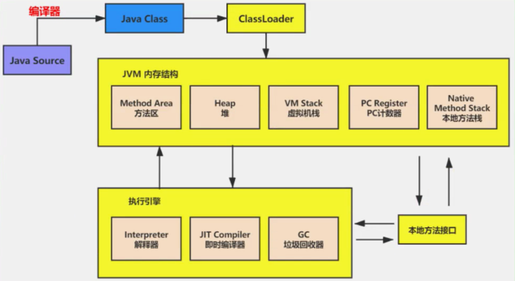
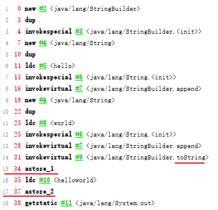
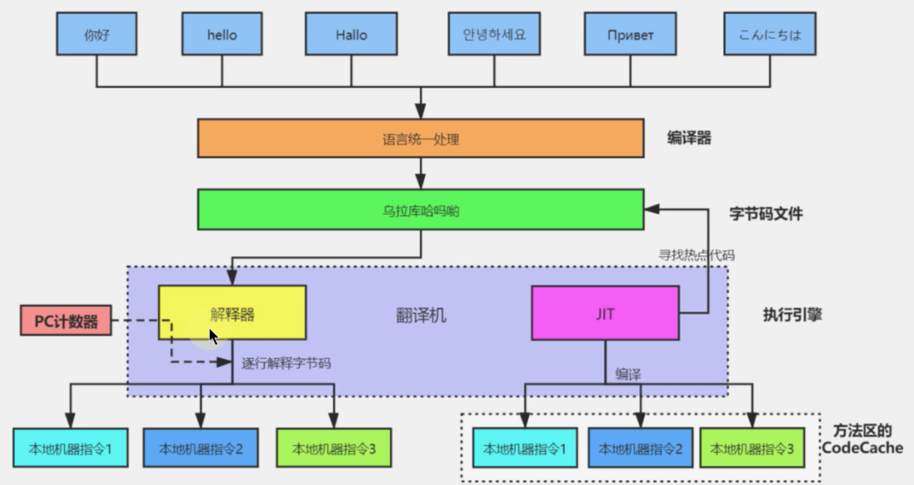

# 第18章 Class文件结构

## 1 概述

* 作为Java程序员，为什么我们需要接触字节码文件？

  * 字节码文件的跨平台性

  1. <font color=red>**Java语言：跨平台的语言（write once, run anywhere）**</font>
     * 当Java源代码成功编译成字节码后，如果想在不同平台运行，则无需再次编译
     * 这个优势不再那么吸引人了。Python、PHP、Perl、Ruby、Lisp等有强大的编译器
     * 跨平台似乎已经快成为一门语言必选的特性了
  2. <font color=red>**Java虚拟机：跨语言的平台**</font>
     * <font color=red>**Java虚拟机不和包括Java在内的任何语言绑定，它只与“Class文件”这种特定的二进制文件格式所关联。**</font>无论使用何种语言进行软件开发，只要能将源文件编译为正确的Class文件，那么这种预压就可以在Java虚拟机上执行。可以说，统一而强大的Class文件结构，就是Java虚拟机的基石、桥梁。

  

  https://docs.oracle.com/javase/specs/index.html

  所有的JVM都遵循Java虚拟机规范，也就是说所有的JVM环境都是一样的，这样一来字节码文件可以在各种JVM上运行。

  3. **想要让一个Java程序正确地运行在JVM中，Java源码就就必须要被编译为符合JVM规范的字节码。**

     * <font color=red>**前端编译器的主要任务**</font>就是负责将符合Java语法规范的Java代码转换为符合JVM规范的字节码文件。
     * javac是一种能够将Java源码编译为字节码的前端编译器。
     * javac编译器在将Java源码编译为一个有效的字节码文件过程中经历了4个步骤，分别是<font color=red>**词法解析、语法解析、语义解析以及生成字节码**</font>。

     

     Oracle的JDK软件包括两部分内容：

     * 一部分是将Java源代码编译成Java虚拟机的指令集的编译器
     * 另一部分是用于实现Java虚拟爱的运行时环境

  * 可以通过字节码指令看代码细节

  1. **BAT面试题**

     ①  类文件结构有几个部分？

     ②  知道字节码吗？字节码指令都有哪些？Integer x = 5; int y = 5;比较x == y 都经过哪些步骤？

  2. **代码举例**

     * 例1

     ```java
     public class IntegerTest {
         public static void main(String[] args) {
             Integer x = 5;
             int y = 5;
             System.out.println(x == y); // true
     
             Integer i1 = 10;
             Integer i2 = 10;
             System.out.println(i1 == i2);  // true
     
             Integer i3 = 128;
             Integer i4 = 128;
             System.out.println(i3 == i4);  // false
         }
     }
     ```

     * 例2

     ```java
     public class StringTest {
         public static void main(String[] args) {
             String str = new String("hello") + new String("world");
             String str1 = "helloworld";
             System.out.println(str == str1);  // false
             String str2 = new String("helloworld");
             System.out.println(str == str2);  // false
         }
     }
     ```

     

     * 例3

     ```java
     /*
     成员变量（非静态的）的赋值过程： ① 默认初始化 - ② 显式初始化 /代码块中初始化 - ③ 构造器中初始化 - ④ 有了对象之后，可以“对象.属性”或"对象.方法"
      的方式对成员变量进行赋值。
      */
     class Father {
         int x = 10;  // ② 显示初始化
         int y;  // ① 默认初始化为0
         public Father() {
             this.print();
             x = 20;  // ③ 构造器中初始化
         }
         public void print() {
             System.out.println("Father.x = " + x);
         }
     }
     
     class Son extends Father {
         int x = 30;
         public Son() {
             this.print();
             x = 40;
         }
         public void print() {
             System.out.println("Son.x = " + x);
         }
     }
     
     public class SonTest {
         public static void main(String[] args) {
             Father f = new Son();
             System.out.println(f.x);
         }
     }
     ```

     **结果：**

     ​			Son.x = 0
     ​			Son.x = 30
     ​			20

     

     main中的代码执行：首先会调用Father的构造器方法，然后调用到Father()中的this.print()方法，因为子类重写了该方法，所以会调用子类的方法，此时输出子类的x，为0；然后Son中的 x 进行显式初始化，赋值为30，调用Son中的this.print()后输出30；之后 x 被赋值为 40，因为 f 类型是 Father，属性不存在多态性，所以最后输出20

* Java的 前端编译器 vs. 后端编译器

  

  * Java源代码的编译结果是字节码，那么肯定需要一种编译器能够将Java源码编译为字节码，承担这个重要责任的就是配置在path环境变量中的<font color=red>**javac编译器**</font>。javac是一种能够将Java源码编译为字节码的<font color=red>**前端编译器**</font>。
  * HotSpot VM并没有强制要求前端编译器只能使用javac来编译字节码，其实只要编译结果符合JVM规范都可以被JVM所识别即可。在Java的前端编译器领域，除了javac之外，还有一种被大家经常使用到的前端编译器，那就是内置在Eclipse中的<font color=red>**ECJ（Eclipse Compiler for Java）编译器**</font>。和javac的全量式编译不同，ECJ是一种增量式编译器。
    * 在Eclipse中，当开发人员编写完代码后，使用“Ctrl+S”快捷键时，ECJ编译器采取的<font color=red>**编译方案**</font>是把未编译部分的源码逐行进行编译，而非每次都全量编译。因此ECJ的编译效率会比javac更加迅速和高效，当然编译质量和javac相比大致还是一样的。
    * ECJ不仅是Eclipse的默认内置前端编译器，在Tomcat中同样也是使用ECJ编译器来编译jsp文件。由于ECJ编译器是采用GPLv2的开源协议进行源代码公开，所以大家可以登录Eclipse官网下载ECJ编译器的源码进行二次开发。
    * 默认情况下，IntelliJ IDEA使用javac编译器（还可以自己设置AspectJ编译器ajc）
  * 前端编译器并不会直接涉及编译优化等方面的技术，而是将这些具体优化细节移交给HotSpot的JIT编译器负责。
  * 复习：AOT（静态提前编译器，Ahead Of Time Compiler）


## 2 虚拟机的基石：Class文件

* 字节码文件是什么？

  * 源代码经过编译器编译之后便会生成一个字节码文件，字节码文件是一种二进制的类文件，它的内容是JVM的指令，而不像C、C++经由编译器直接生成机器码。

* 什么是字节码指令（byte code）？

  * Java虚拟机的指令由一个字节长度的、代表着某种特定操作含义的<font color=red>**操作码**</font>（opcode）以及跟随其后的零至多个代表次操作所需参数的<font color=red>**操作数**</font>（operand）所构成。虚拟机中许多指令并不包含操作数，只有一个操作码。

  

* 如何解读供虚拟机解释执行的二进制字节码？

  * 方式一：一个一个二进制的看，这里用到的是Notepad++，需要安装一个HEX-Editor插件，或者使用Binary Viewer
  * 方式二：使用javap指令：jdk自带的反解析工具
  * 方式三：使用IDEA插件：jclasslib或jclasslib bytecode viewer客户端工具。（可视化更好）

## 3 Class文件结构

* 官方文档位置：https://docs.oracle.com/javase/specs/jvms/se8/html/jvms-4.html

* Class类的本质

  * 任何一个Class文件都对应着唯一一个类或接口的定义信息，但反过来说，Class文件实际上它并不一定以磁盘文件的形式存在。Class文件是一组以8位字节为基础的<font color=red>**二进制流**</font>。

* Class文件格式

  * Class的结构不像XML等描述语言，由于它没有任何分割符号。所以在其中的数据项，无论是字节顺序还是数量，都是被严格限定的，哪个字节代表什么含义，长度时多少，先后顺序如何，都不允许改变。

  * Class文件格式采用一种类似于C语言结构体的方式进行数据存储，这种数据结构只有两种数据类型：<font color=red>**无符号数**</font>和<font color=red>**表**</font>。

    * 无符号数属于基本数据类型，以 u1、u2、u4、u8 来分别代表 1 个字节、2个字节、4个字节和 8 个字节的无符号数，无符号数可以用来描述数字、索引引用、数量值或者按照 UTF-8 编码构成的字符串值。
    * 表是由多个无符号数或者其他表作为数据项构成的符合数据类型，所有表都习惯性地以"_info"结尾。表用于描述有层次关系的符合结构的数据，整个Class文件本质上就是一张表。由于表没有固定长度，所以通常会在其前面加上个数说明。

  * 代码举例

    ```java
    package com.atguigu.java1;
    
    /**
     * @author shkstart
     * @create 2020-08-31 8:52
     * 全类名：com.atguigu.java1.Demo
     * 全限定名：com/atguigu/java1/Demo
     */
    public class Demo {
        private int num = 1;
    
        public int add(){
            num = num + 2;
            return num;
        }
    }
    ```

    生成的Demo.class里面的内容如下：

    

---

* Class文件结构概述

  Class文件的结构并不是一成不变的，随着Java虚拟机的不断发展，总是不可避免的对Class文件结构做出一些调整，但是其基本结构和框架是非常稳定的。

  * Class文件的总体结构如下：
    * 魔数
    * Class文件版本
    * 常量池
    * 访问标志
    * 类索引，父类索引，接口索引集合
    * 字段表集合
    * 方法表集合
    * 属性表集合

  

  | 类型           | 名称                | 说明                    | 长度    | 数量                  |
  | -------------- | ------------------- | ----------------------- | ------- | --------------------- |
  | u4             | magic               | 魔数，识别Class文件格式 | 4个字节 | 1                     |
  | u2             | minor_version       | 副版本号（小版本）      | 2个字节 | 1                     |
  | u2             | major_version       | 主版本号（大版本）      | 2个字节 | 1                     |
  | u2             | constant_pool_count | 常量池计数器            | 2个字节 | 1                     |
  | cp_info        | constant_pool       | 常量池表                | n个字节 | constant_pool_count-1 |
  | u2             | access_flags        | 访问标识                | 2个字节 | 1                     |
  | u2             | this_class          | 类索引                  | 2个字节 | 1                     |
  | u2             | super_class         | 父类索引                | 2个字节 | 1                     |
  | u2             | interfaces_count    | 接口计数器              | 2个字节 | 1                     |
  | u2             | interfaces          | 接口索引集合            | 2个字节 | interfaces_count      |
  | u2             | fields_count        | 字段计数器              | 2个字节 | 1                     |
  | field_info     | fields              | 字段表                  | n个字节 | fields_count          |
  | u2             | methods_count       | 方法计数器              | 2个字节 | 1                     |
  | method_info    | methods             | 方法表                  | n个字节 | methods_count         |
  | u2             | attributes_count    | 属性计数器              | 2个字节 | 1                     |
  | attribute_info | attributes          | 属性表                  | n个字节 | attributes_count      |

  

---


---

* Magic Number（魔数）

  * 每个Class文件开头的4个字节的无符号整数称为魔数（Magic Number）

  * 它的唯一作用是确定这个文件是否为一个能被虚拟机接收的有效合法的Class文件。即：魔数是Class文件的标识符。

  * 魔数值固定为 0xcafebabe。不会改变。

  * 如果一个Class文件不是以 0xcafebabe 开头，虚拟机在进行文件校验的时候的时候就会抛出以下错误：

    

  * 使用魔数而不是扩展名来进行识别主要是基于安全方面的考虑，因为文件扩展名可以随意改动。

---

* Class文件版本号

  * 紧接着魔数的 4 个字节存储的是Class文件的版本号。同样也是 4 个字节。第 5 个和第 6 个字节代表的含义就是编译的副版本号minor_version，而第 7 个和第 8 个字节就是编译的主版本号major_version。

  * 他们共同构成了class文件的格式版本号。譬如某个Clacc文件的主版本号为M，副版本号为m，那么这个Class文件的格式版本号就确定为 M.m。

  * 版本号和Java编译器的对应关系如下表：

    | 主版本（十进制） | 副版本（十进制） | 编译器版本 |
    | ---------------- | ---------------- | ---------- |
    | 45               | 3                | 1.1        |
    | 46               | 0                | 1.2        |
    | 47               | 0                | 1.3        |
    | 48               | 0                | 1.4        |
    | 49               | 0                | 1.5        |
    | 50               | 0                | 1.6        |
    | 51               | 0                | 1.7        |
    | 52               | 0                | 1.8        |
    | 53               | 0                | 1.9        |
    | 54               | 0                | 1.10       |
    | 55               | 0                | 1.11       |

  * Java的版本号是从 45 开始的，JDK1.1之后的每个JDK大版本发布主版本号加1。

  * <font color=red>**不同版本的Java编译器编译的Class文件对应的版本是不一样的。目前，高版本的Java虚拟机可以执行低版本编译器生成的Class文件，但是低版本的Java虚拟机不能执行由高版本编译器生成的Class文件。否则JVM会抛出java.lang.UnsupportedClassVersionError异常**</font>。

    * 演示在 JDK1.8 编译出的class文件在 1.6的环境下运行

      

      

      

  * 在实际应用中，由于开发环境和生产环境的不同。可能会导致上述问题的发生。因此，需要我们在开发时，特别注意开发编译的JDK版本和实际生产环境中的JDK版本是否一致。

    * 虚拟机JDK版本为 1.k（k >= 2）时，对应的class文件版本号范围为45.0 - 44+k.0（含两端）。

---

* 常量池：存放所有常量

  * 常量池是Class文件中内容最为丰富的区域之一。常量池对于Class文件中的字段和方法解析也有着至关重要的作用。
  * 随着Java虚拟机的不断发展，常量池的内容也日渐丰富。可以说，常量池是整个Class文件的基石。

  

  * 在版本号之后，紧跟着的是常量池中常量的数量，以及若干个常量池表项。
  * 常量池中常量的数量不是固定的，所以在常量池的入口需要放置一项 u2 类型的无符号数，代表常量池容量计数值（constant_pool_count）。与Java中语言习惯不一样的是，这个容量计数器是从1而不是从0开始的。

  | 类型           | 名称                | 数量                  |
  | -------------- | ------------------- | --------------------- |
  | u2（无符号数） | constant_pool_count | 1                     |
  | cp_info（表）  | constant_pool       | constant_pool_count-1 |

  由上表可见，Class文件使用了一个前置的容量计数器（constant_pool_count）加上若干个连续的数据项（constant_pool）的形式来描述常量池内容。我们把这一系列连续常量池数据成为常量池集合。

  * <font color=red>**常量池表项**</font>中，用于存放编译时期生成的各种<font color=blue>**字面量**</font>和<font color=blue>**符号引用**</font>，这部分内容将在类加载（具体是指：加载、链接（验证、初始化、解析）、初始化中的链接阶段中的解析阶段）后进入方法区的<font color=red>**运行时常量池**</font>中存放。

  

  

  * **常量池计数器（constant_pool_count）**

    * 由于常量池的数量不固定，时长时短，所以需要放置两个字节来表示常量池容量计数值。
    * 常量池容量计数器（u2类型）：**从 1 开始**，表示常量池中有多少项常量。即 constant_pool_count=1 表示常量池中有0个常量项。
    * Demo的值为：

    

    其值为0x0016，转换为十进制是22。需要注意的是，这实际上只有21项常量。索引范围是1-21.为什么呢？

    * 通常我们写代码时都是从0开始的，但是这里的常量池却是从1开始，因为它把第0项常量空出来了。这是为了满足后面某些指向常量池的索引值的数据在特定情况下需要表达“不引用任何一个常量池项目”的含义，这种情况可以用索引0来表示。

  

  

  * **常量池表（constant_pool []）**

    * constant_pool 是一种表结构，以 1 ~ constant_pool _count - 1为索引。表明后面有多少常量项。
    * 常量池主要存放两大类常量：<font color=red>**字面量（Literal）**</font>和<font color=red>**符号引用（Symbolic References）**</font>。
    * 它包含了class文件结构及其子结构中引用的所有字符串常量、类或接口名和其他常量。常量池中的每一项都具备相同的特征。第一个字节作为标记类型，用于确定该项的格式，这个字节称为**tag type**（标记字节、标签字节）：一共14个

    | 类型                             | 标志（标识） | 描述                   |
    | -------------------------------- | ------------ | ---------------------- |
    | CONSTANT_utf8_info               | 1            | UTF-8编码的字符串      |
    | CONSTANT_Integer_info            | 3            | 整形字面量             |
    | CONSTANT_Float_info              | 4            | 浮点型字面量           |
    | CONSTANT_Long_info               | 5            | 长整型字面量           |
    | CONSTANT_Double_info             | 6            | 双精度浮点型字面量     |
    | CONSTANT_Class_info              | 7            | 类或接口的符号引用     |
    | CONSTANT_String_info             | 8            | 字符串类型字面量       |
    | CONSTANT_Fieldref_info           | 9            | 字段的符号引用         |
    | CONSTANT_Methodref_info          | 10           | 类中方法的符号引用     |
    | CONSTANT_InterfaceMethodref_info | 11           | 接口中方法的符号引用   |
    | CONSTANT_NameAndType_info        | 12           | 字段或方法的的符号引用 |
    | CONSTANT_MethodHandle_info       | 15           | 表示方法句柄           |
    | CONSTANT_MethodType_info         | 16           | 标志方法类型           |
    | CONSTANT_InvokeDynamic_info      | 18           | 表示一个动态方法调用点 |

    * 字面量和符号引用

      在对这些常量解读之前，我们需要搞清楚几个概念。

      常量池主要存放两大类常量：字面量（Literal）和符号引用（Symbolic Reference）。如下表：

      |   常量   |     具体的常量      |
      | :------: | :-----------------: |
      |  字面量  |     文本字符串      |
      |          | 声明为final的常量值 |
      | 符号引用 | 类和接口的全限定名  |
      |          | 字段的名称和描述符  |
      |          | 方法的名称和描述符  |

      * 全限定名

      com/atguigu/test/Demo这个就是类的全限定名，仅仅是把包名的 “.” 替换成 “/” ，为了使连续的多个全限定名不产生混淆，在使用时最后一版会加入一个 “;” 表示全限定名结束。

      * 简单名称

      简单名称是指没有类型和参数修饰的方法或者字段名称，上面例子中的类的add()方法和num字段的简单名称分别是add 和 num。

      * 描述符

      <font color=red>**描述符的作用是用来描述字段的数据类型、方法的参数列表（包括数量、类型以及顺序）和返回值。**</font>根据描述符规则，基本数据类型（byte、char、short、boolean、int、long、float、double）以及代表无返回值的void类型都应一个大写字母来表示，而对象类型则用字符 **L** 加对象的全限定名表示，详见下表：

      | 标识符 | 含义                                                         |
      | ------ | ------------------------------------------------------------ |
      | B      | 基本数据类型byte                                             |
      | C      | 基本数据类型char                                             |
      | S      | 基本数据类型short                                            |
      | Z      | 基本数据类型boolean                                          |
      | I      | 基本数据类型int                                              |
      | J      | 基本数据类型long                                             |
      | F      | 基本数据类型float                                            |
      | D      | 基本数据类型double                                           |
      | V      | 代表void类型                                                 |
      | L      | 对象类型，比如：Ljava/lang/Object;                           |
      | [      | 数组类型，代表一维数组。比如：double[][][][][][\][\] is [[[D |

      例子：

      ```java
      public class ArrayTest {
          public static void main(String[] args) {
              Object[] arr = new Object[10];
              System.out.println(arr);  // [Ljava.lang.Object;@1540e19d
      
              String[] arr1 = new String[10];
              System.out.println(arr1);  // [Ljava.lang.String;@677327b6
      
              long[][] arr2 = new long[10][];
              System.out.println(arr2);  // [[J@14ae5a5
          }
      }
      ```

      * 补充说明：虚拟机在加载Class文件时才会进行动态链接，也就是说，Class文件不会保存各个字段和方法的最终内存布局信息，因此，这些字段和方法的符号引用不经过转换是无法直接被虚拟机使用的。<font color=red>**当虚拟机运行时，需要从常量池中获得对应的符号引用，再在类加载过程中的解析阶段将其替换为直接引用，并翻译到具体的内存地址中。**</font>这里说明下符号引用和直接引用的区别和关联：
        * 符号引用：符号引用以<font color=red>**一组符号**</font>来描述所引用的目标，符号可以是任何形式的字面量，只要使用时能无歧义地定位到目标即可。<font color=red>**符号引用与虚拟机实现的内存布局无关**</font>，引用的目标并不一定已经加载到了内存中。
        * 直接引用：直接引用可以是直接<font color=red>**指向目标的指针、相对偏移量或是一个能间接定位到目标的句柄**</font>。<font color=red>**直接引用是与虚拟机实现的内存布局相关的**</font>，同一个符号引用在不同虚拟机实例上翻译出来的直接引用一般不会相同。如果有了直接引用，那说明引用的目标必然已经存在于内存之中了。（虚拟机栈中的动态链接指向的内容：即方法区中的运行时常量池）

      

  * 常量池表小结：

    * CONSTANT_Integer_info出现在常量池表中的前提是要声明一个 final int 的常量

    * 标记为15、16、18的常量项类型是用来支持动态语言调用的（jdk1.7时才加入）。

    * 细节说明：

      * CONSTANT_Class_info 结构用于表明类或接口
      * CONSTANT_Fieldref_info、CONSTANT_Methodref_info、CONSTANT_InterfaceMethodref_info 结构表示字段、方法和接口方法
      * CONSTANT_String_info 结构用于表示 String 类型的常量对象
      * CONSTANT_Integer_info和CONSTANT_Float_info 表示 4 个字节（int 和 float）的数值常量
      * CONSTANT_Long_info 和 CONSTANT_Double_info 结构表示 8 字节（long 和 double）的数值常量
        * 在class文件的常量池表中，所有的 8 字节常量均占两个表成员（项）的空间。如果一个CONSTANT_Long_info 或 CONSTANT_Double_info 结构的项在常量池中的索引位置为n，则常量池表中的下一个可用项的索引位置为n+2，此时常量池表中索引位n+1的项仍然有效但必须视为不可用的。
      * CONSTANT_NameAndType_info 结构用于表示字段或方法，但是和之前的三个结构不同。CONSTANT_NameAndType_info结构没有指明该字段或方法所属的类或接口。
      * CONSTANT_utf8_info 用于表示字符串常量的值
      * CONSTANT_MethodHandle_info 结构用于表示方法句柄
      * CONSTANT_MethodType_info 结构用于表示方法类型
      * CONSTANT_InvokeDynamic_info 结构用于表示 invokedynamic指令所用到的引导方法（bootstrap method）、引导方法所用到的动态调用名称（dynamic invocation name）、参数和返回类型。并可以给引导方法传入一系列称为静态参数（static argument）的常量。

    * 解析方式：一个字节一个字节的解析

      

    * 总结1：

      * 这14种表（或者常量项结构）的共同点是：表开始的第一位是一个u1类型的标志位（tag），代表当前这个常量项使用的是哪种表结构，即哪种常量类型。
      * 在常量池列表中，CONSTANT_String_info 常量项是一种使用改进过得UTF-8编码格式来存储的如文字字符串、类或者接口的全限定名、字段或者方法的简单名称以及描述符等常量字符串信息。
      * 这14中常量项结构还有一个特点是，其中13项占用的字节数固定，只有CONSTANT_utf8_info 占用字节数不固定，其大小由length决定。为什么呢？<font color=red>**因为从常量池存放的内容可知，其存放的是字面量和符号引用，最终这些内容都会是一个字符串，这些字符串的大小是在编写程序时才确定**</font>，比如你定义一个类，类名可以取长取短，所以在没编译前，大小不固定，编译后，通过utf-8编码，就可以知道其长度。

    * 总结2：

      * 常量池：可以理解为Class文件之中的资源仓库，它是Class文件结构中与其他项目关联最多的数据类型（后面的很多数据类型都会指向此处），也是占用Class文件空间最大的数据项目之一。
      * **常量池中为什么要包含这些内容？**
        * Java代码在进行javac编译的时候，并不像C和C++那样有“链接”这一步骤，而是在虚拟机加载Class文件的时候才进行动态链接。也就是说，<font color=red>**在Class文件中不会保存各个方法、字段的最终内存布局信息，因此这些字段、方法的符号引用不经过运行期转换的话无法得到真正的内存入口地址，也就无法直接被虚拟机使用。**</font>当虚拟机运行时，需要从常量池获得对应的符号引用，再在类创建或运行时解析、翻译到具体的内存地址之中。关于类的创建和动态链接的内容，在虚拟机类加载过程时再进行详细讲解。

## 4 使用javap指令解析Class文件

